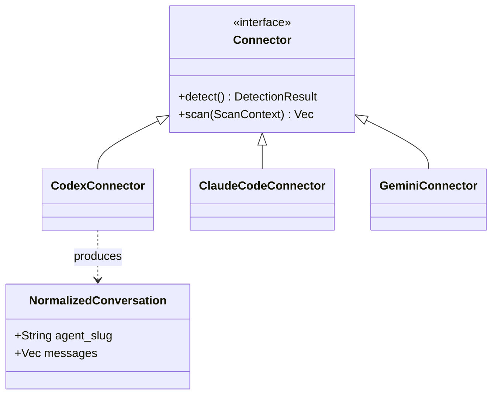
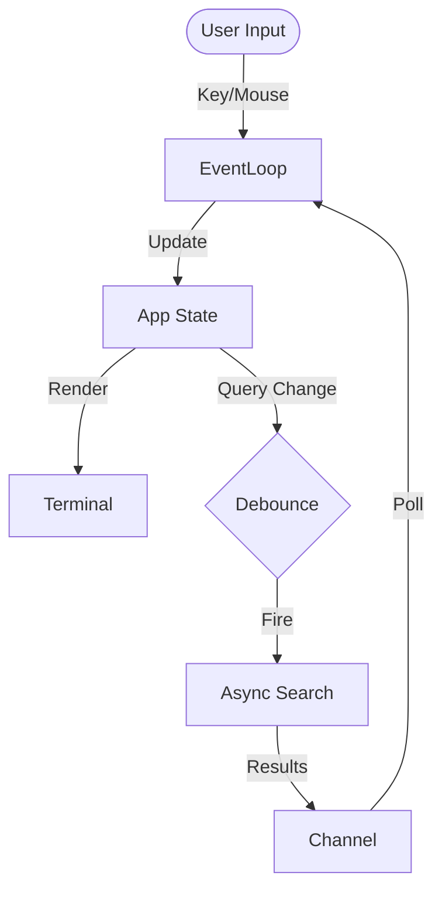

# 🔎 coding-agent-search (cass)


**Unified, high-performance TUI to index and search your local coding agent history.**  
Aggregates sessions from Codex, Claude Code, Gemini CLI, Cline, OpenCode, and Amp into a single, searchable timeline.

<div align="center">

```bash
# Fast path: checksum-verified install + self-test
curl -fsSL https://raw.githubusercontent.com/Dicklesworthstone/coding_agent_session_search/main/install.sh \
  | bash -s -- --easy-mode --verify
```

```powershell
# Windows (PowerShell)
irm https://raw.githubusercontent.com/Dicklesworthstone/coding_agent_session_search/main/install.ps1 | iex
install.ps1 -EasyMode -Verify
```

</div>

---

## ✨ Key Features

### ⚡ Instant Search (Sub-60ms Latency)
- **"Search-as-you-type"**: Results update instantly with every keystroke.
- **Edge N-Gram Indexing**: We frontload the work by pre-computing prefix matches (e.g., "cal" -> "calculate") during indexing, trading disk space for O(1) lookup speed at query time.
- **Smart Tokenization**: Handles `snake_case` ("my_var" matches "my" and "var"), hyphenated terms, and code symbols (`c++`, `foo.bar`) correctly.
- **Zero-Stall Updates**: The background indexer commits changes atomically; `reader.reload()` ensures new messages appear in the search bar immediately without restarting.

### 🖥️ Rich Terminal UI (TUI)
- **Three-Pane Layout**: Filter bar (top), scrollable results (left), and syntax-highlighted details (right).
- **Live Status**: Footer shows real-time indexing progress (e.g., `Indexing 150/2000 (7%)`) and active filters.
- **Mouse Support**: Click to select results, scroll panes, or clear filters.
- **Theming**: Adaptive Dark/Light modes with role-colored messages (User/Assistant/System).

### 🔗 Universal Connectors
Ingests history from all major local agents, normalizing them into a unified `Conversation -> Message -> Snippet` model:
- **Codex**: `~/.codex/sessions` (Rollout JSONL)
- **Cline**: VS Code global storage (Task directories)
- **Gemini CLI**: `~/.gemini/tmp` (Chat JSON)
- **Claude Code**: `~/.claude/projects` (Session JSONL)
- **OpenCode**: `.opencode` directories (SQLite)
- **Amp**: `~/.local/share/amp` & VS Code storage

---

## 🏎️ Performance Engineering: Caching & Warming
To achieve sub-60ms latency on large datasets, `cass` implements a multi-tier caching strategy in `src/search/query.rs`:

1.  **Sharded LRU Cache**: The `prefix_cache` is split into shards (default 256 entries each) to reduce mutex contention during concurrent reads/writes from the async searcher.
2.  **Bloom Filter Pre-checks**: Each cached hit stores a 64-bit Bloom filter mask of its content tokens. When a user types more characters, we check the mask first. If the new token isn't in the mask, we reject the cache entry immediately without a string comparison.
3.  **Predictive Warming**: A background `WarmJob` thread watches the input. When the user pauses typing, it triggers a lightweight "warm-up" query against the Tantivy reader to pre-load relevant index segments into the OS page cache.

## 🔌 The Connector Interface (Polymorphism)
The system is designed for extensibility via the `Connector` trait (`src/connectors/mod.rs`). This allows `cass` to treat disparate log formats as a uniform stream of events.



- **Polymorphic Scanning**: The indexer iterates over a `Vec<Box<dyn Connector>>`, unaware of the underlying file formats (JSONL, SQLite, specialized JSON).
- **Resilient Parsing**: Connectors handle legacy formats (e.g., integer vs ISO timestamps) and flatten complex tool-use blocks into searchable text.

---

## 🧠 Architecture & Engineering

`cass` employs a dual-storage strategy to balance data integrity with search performance.

### The Pipeline
1.  **Ingestion**: Connectors scan proprietary agent files and normalize them into standard structs.
2.  **Storage (SQLite)**: The **Source of Truth**. Data is persisted to a normalized SQLite schema (`messages`, `conversations`, `agents`). This ensures ACID compliance, reliable storage, and supports complex relational queries (stats, grouping).
3.  **Search Index (Tantivy)**: The **Speed Layer**. New messages are incrementally pushed to a Tantivy full-text index. This index is optimized for speed:
    *   **Fields**: `title`, `content`, `agent`, `workspace`, `created_at`.
    *   **Prefix Fields**: `title_prefix` and `content_prefix` use **Index-Time Edge N-Grams** (not stored on disk to save space) for instant prefix matching.
    *   **Deduping**: Search results are deduplicated by content hash to remove noise from repeated tool outputs.

```mermaid
flowchart LR
    classDef pastel fill:#f4f2ff,stroke:#c2b5ff,color:#2e2963;
    classDef pastel2 fill:#e6f7ff,stroke:#9bd5f5,color:#0f3a4d;
    classDef pastel3 fill:#e8fff3,stroke:#9fe3c5,color:#0f3d28;
    classDef pastel4 fill:#fff7e6,stroke:#f2c27f,color:#4d350f;
    classDef pastel5 fill:#ffeef2,stroke:#f5b0c2,color:#4d1f2c;

    subgraph Sources
      A[Codex
      Cline
      Gemini
      Claude
      OpenCode
      Amp]:::pastel
    end

    subgraph "Ingestion Layer"
      C1[**Connectors**<br/>Detect & Scan<br/>Normalize<br/>Dedupe]:::pastel2
    end

    subgraph "Dual Storage"
      S1[**SQLite (WAL)**<br/>Source of Truth<br/>Relational Data<br/>Migrations]:::pastel3
      T1[**Tantivy Index**<br/>Search Optimized<br/>Edge N-Grams<br/>Prefix Cache]:::pastel4
    end

    subgraph "Presentation"
      U1[**TUI (Ratatui)**<br/>Async Search<br/>Filter Pills<br/>Details]:::pastel5
      U2[**CLI / Robot**<br/>JSON Output<br/>Automation]:::pastel5
    end

    A --> C1
    C1 -->|Persist| S1
    C1 -->|Index New| T1
    S1 -.->|Rebuild| T1
    T1 -->|Query| U1
    T1 -->|Query| U2
```

### Background Indexing & Watch Mode
- **Non-Blocking**: The indexer runs in a background thread. You can search while it works.
- **Watch Mode**: Uses file system watchers (`notify`) to detect changes in agent logs. When you save a file or an agent replies, `cass` re-indexes just that conversation and refreshes the search view automatically.
- **Progress Tracking**: Atomic counters track scanning/indexing phases, displayed unobtrusively in the TUI footer.

## 🔍 Deep Dive: Internals

### The TUI Engine (State Machine & Async Loop)
The interactive interface (`src/ui/tui.rs`) is the largest component (~3.5k lines), implementing a sophisticated **Immediate Mode** architecture using `ratatui`.

1.  **Application State**: A monolithic struct tracks the entire UI state (search query, cursor position, scroll offsets, active filters, and cached details).
2.  **Event Loop**: A polling loop handles standard inputs (keyboard/mouse) and custom events (Search results ready, Progress updates).
3.  **Debouncing**: User input triggers an async search task via a `tokio` channel. To prevent UI freezing, we debounce keystrokes (150ms) and run queries on a separate thread, updating the state only when results return.
4.  **Optimistic Rendering**: The UI renders the *current* state immediately (60 FPS), drawing "stale" results or loading skeletons while waiting for the async searcher.



### Append-Only Storage Strategy
Data integrity is paramount. `cass` treats the SQLite database (`src/storage/sqlite.rs`) as an **append-only log** for conversations:

- **Immutable History**: When an agent adds a message to a conversation, we don't update the existing row. We insert the new message linked to the conversation ID.
- **Deduplication**: The connector layer uses content hashing to prevent duplicate messages if an agent re-writes a file.
- **Versioning**: A `schema_version` meta-table and strict migration path ensure that upgrades (like the recent move to v3) are safe and atomic.

---

## 🚀 Quickstart

### 1. Install
```bash
curl -fsSL https://raw.githubusercontent.com/Dicklesworthstone/coding_agent_session_search/main/install.sh \
  | bash -s -- --easy-mode --verify
```

### 2. Launch
```bash
cass
```
*On first run, `cass` performs a full index. You'll see progress in the footer. Search works immediately (falling back to SQLite or partial results until complete).*

### 3. Usage
- **Type to search**: "python error", "refactor auth", "c++".
- **Navigation**: `Up`/`Down` to select, `Right` to focus detail pane.
- **Filters**:
    - `F3`: Filter by Agent (e.g., "codex").
    - `F4`: Filter by Workspace/Project.
    - `F5`/`F6`: Time filters (Today, Week, etc.).
- **Actions**:
    - `Enter`: Open original log file in `$EDITOR`.
    - `y`: Copy file path or snippet to clipboard.

---

## 🛠️ CLI Reference

The `cass` binary supports both interactive use and automation.

```bash
cass [tui] [--data-dir DIR] [--once]
cass index [--full] [--watch] [--data-dir DIR]
cass search "query" --robot --limit 5
cass stats --json
```

- **cass (default)**: Starts TUI + background watcher.
- **index --full**: Forces a complete rebuild of the DB and Index.
- **index --watch**: Runs essentially as a daemon, watching for file changes.
- **search --robot**: Outputs JSON for other tools to consume.

## 🤖 AI / Automation Mode

`cass` is designed to be used by *other* AI agents.

- **Self-Documenting**: Run `cass --robot-help` for a machine-optimized guide (Contract v1).
- **Structured Data**: Use `--robot` or `--json` for strictly typed JSON output on stdout.
- **Exit Codes**:
    - `0`: Success
    - `2`: Usage error
    - `3`: Missing index (run `cass index --full`)
    - `9`: Unknown error
- **Traceability**: Use `--trace-file <path>` to log execution spans for debugging.

### Ready-to-paste blurb for AGENTS.md / CLAUDE.md
> **cass (Coding Agent Session Search)** — High-performance local search for agent history.
> - **Discovery**: `cass --robot-help` (prints automation contract).
> - **Search**: `cass search "query" --robot [--limit N --agent codex]`.
> - **Inspect**: `cass view <source_path> -n <line> --json`.
> - **Manage**: `cass index --full` (rebuilds index).
> - **Design**: stdout is data-only JSON; stderr is diagnostics.

---

## 🔒 Integrity & Safety

- **Verified Install**: The installer enforces SHA256 checksums.

- **Sandboxed Data**: All indexes/DBs live in standard platform data directories (`~/.local/share/coding-agent-search` on Linux).

- **Read-Only Source**: `cass` *never* modifies your agent log files. It only reads them.


## 📦 Installer Strategy

The project ships with a robust installer (`install.sh` / `install.ps1`) designed for CI/CD and local use:

- **Checksum Verification**: Validates artifacts against a `.sha256` file or explicit `--checksum` flag.

- **Rustup Bootstrap**: Automatically installs the nightly toolchain if missing.

- **Easy Mode**: `--easy-mode` automates installation to `~/.local/bin` without prompts.

- **Platform Agnostic**: Detects OS/Arch (Linux/macOS/Windows, x86_64/arm64) and fetches the correct binary.


## ⚙️ Environment

- **Config**: Loads `.env` via `dotenvy::dotenv().ok()`; configure API/base paths there. Do not overwrite `.env`.

- **Data Location**: Defaults to standard platform data directories (e.g., `~/.local/share/coding-agent-search`). Override with `CASS_DATA_DIR` or `--data-dir`.

- **Logs**: Written to `cass.log` (daily rotating) in the data directory.

- **Updates**: Interactive TUI checks for GitHub releases on startup. Skip with `CODING_AGENT_SEARCH_NO_UPDATE_PROMPT=1` or `TUI_HEADLESS=1`.


## 🩺 Troubleshooting

- **Checksum mismatch**: Ensure `.sha256` is reachable or pass `--checksum` explicitly. Check proxies/firewalls.

- **Binary not on PATH**: Append `~/.local/bin` (or your `--dest`) to `PATH`; re-open shell.

- **Nightly missing in CI**: Set `RUSTUP_INIT_SKIP=1` if toolchain is preinstalled; otherwise allow installer to run rustup.

- **Watch mode not triggering**: Confirm `watch_state.json` updates and that connector roots are accessible; `notify` relies on OS file events (inotify/FSEvents).


## 🧪 Developer Workflow

We target **Rust Nightly** to leverage the latest optimizations.


```bash

# Format & Lint

cargo fmt --check

cargo clippy --all-targets -- -D warnings


# Build & Test

cargo build --release

cargo test


# Run End-to-End Tests

cargo test --test e2e_index_tui

cargo test --test install_scripts

```


## 🤝 Contributing

- Follow the nightly toolchain policy and run `fmt`/`clippy`/`test` before sending changes.

- Keep console output colorful and informative.

- Avoid destructive commands; do not use regex-based mass scripts in this repo.


## 🔍 Deep Dive: How Key Subsystems Work

### Tantivy schema & preview field (v4)
- Schema v4 (hash `tantivy-schema-v4-edge-ngram-preview`) stores agent/workspace/source_path/msg_idx/created_at/title/content plus edge-ngrams (`title_prefix`, `content_prefix`) for type-ahead matching.
- New `preview` field keeps a short, stored excerpt (~200 chars + ellipsis) so prefix-only queries can render snippets without pulling full content.
- Rebuilds auto-trigger when the schema hash changes; index directory is recreated as needed. Tokenizer: `hyphen_normalize` to keep “cma-es” searchable while enabling prefix splits.

### Search pipeline (src/search/query.rs)
- Cache-first: per-agent + global LRU shards (env `CASS_CACHE_SHARD_CAP`, default 256). Cached hits store lowered content/title/snippet and a 64-bit bloom mask; bloom + substring keeps validation fast.
- Fallback order: Tantivy (primary) → SQLite FTS (consistency) with deduping/noise filtering. Prefix-only snippet path tries cached prefix snippet, then a cheap local snippet, else Tantivy `SnippetGenerator`.
- Warm worker: runtime-aware, debounced (env `CASS_WARM_DEBOUNCE_MS`, default 120 ms), runs a tiny 1-doc search to keep the reader hot; reloads are debounced (300 ms) and counted in metrics (cache hit/miss/shortfall/reloads tracked internally).

### Indexer (src/indexer/mod.rs)
- Opens SQLite + Tantivy; `--full` clears tables/FTS and wipes Tantivy docs; `--force-rebuild` recreates index dir when schema changes.
- Connector loop: detect → scan per connector, ingest normalized conversations into SQLite and Tantivy. Watch mode: debounced filesystem watcher, path classification per connector, since_ts tracked in `watch_state.json`, incremental reindex of touched sources. TUI startup spawns a background indexer with watch enabled.

### Storage (src/storage/sqlite.rs)
- Normalized relational model (agents, workspaces, conversations, messages, snippets, tags) with FTS mirror on messages. Single-transaction insert/upsert, append-only unless `--full`. `schema_version` guard; bundled modern SQLite.

### UI (src/ui/tui.rs)
- Three-pane layout (agents → results → detail), responsive splits, focus model (Tab/Shift+Tab), mouse support. Detail tabs (Messages/Snippets/Raw) plus full-screen modal with role colors, code blocks, JSON pretty-print, highlights. Footer packs shortcuts + mode badges; state persisted in `tui_state.json`.

### Connectors (src/connectors/*.rs)
- Each connector implements `detect` (root discovery) and `scan` (since_ts-aware ingestion). External IDs preserved for dedupe; workspace/source paths carried through; roles normalized.

### Installers (install.sh / install.ps1)
- Checksum-verified easy/normal modes, optional quickstart (index on first run), rustup bootstrap if needed. PATH hints appended with warnings; SHA256 required.

### Benchmarks & Tests
- Benches: `index_perf` measures full index build; `runtime_perf` covers search latency + indexing micro-cases.
- Tests: unit + integration + headless TUI e2e; installer checksum fixtures; watch-mode and index/search integration; cache/bloom UTF-8 safety and bloom gate tests.

## 📜 License

MIT or Apache-2.0. See [LICENSE](LICENSE) for details.
