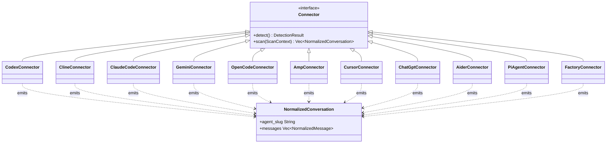

# 🔎 coding-agent-search (cass)


[](https://codecov.io/gh/Dicklesworthstone/coding_agent_session_search)


**Unified, high-performance TUI to index and search your local coding agent history.**
Aggregates sessions from Codex, Claude Code, Gemini CLI, Cline, OpenCode, Amp, Cursor, ChatGPT, Aider, Pi-Agent, and Factory (Droid) into a single, searchable timeline.

<div align="center">

```bash
curl -fsSL "https://raw.githubusercontent.com/Dicklesworthstone/coding_agent_session_search/main/install.sh?$(date +%s)" \
  | bash -s -- --easy-mode --verify
```

```powershell
# Windows (PowerShell)
irm https://raw.githubusercontent.com/Dicklesworthstone/coding_agent_session_search/main/install.ps1 | iex
install.ps1 -EasyMode -Verify
```

**Or via package managers:**

```bash
# macOS/Linux (Homebrew)
brew install dicklesworthstone/tap/cass

# Windows (Scoop)
scoop bucket add dicklesworthstone https://github.com/Dicklesworthstone/scoop-bucket
scoop install dicklesworthstone/cass
```

</div>

---

## 🤖 Agent Quickstart (Robot Mode)

⚠️ **Never run bare `cass` in an agent context** — it launches the interactive TUI. Always use `--robot` or `--json`.

```bash
# 1) Health check (exit 0 = OK, non-zero = rebuild index)
cass health --json || cass index --full

# 2) Search across all agent history
cass search "authentication error" --robot --limit 5 --fields minimal

# 3) View + expand a hit (use source_path/line_number from search output)
cass view /path/to/session.jsonl -n 42 --json
cass expand /path/to/session.jsonl -n 42 -C 3 --json

# 4) Discover the full machine API
cass robot-docs guide
cass robot-docs schemas
```

**Output conventions**
- stdout = data only
- stderr = diagnostics
- exit 0 = success

## 📸 Screenshots

<div align="center">

### Search Results Across All Your Agents
*Three-pane layout: filter bar, results list with color-coded agents (Claude, Codex, Gemini, Pi-Agent, etc.), and syntax-highlighted detail preview*


---

### Rich Conversation Detail View
*Full conversation rendering with markdown formatting, code blocks, headers, and structured content*


---

### Quick Start & Keyboard Reference
*Built-in help screen (press `F1` or `?`) with all shortcuts, filters, modes, and navigation tips*


</div>

---

## 💡 Why This Exists

### The Problem

AI coding agents are transforming how we write software. Claude Code, Codex, Cursor, Copilot, Aider, Pi-Agent; each creates a trail of conversations, debugging sessions, and problem-solving attempts. But this wealth of knowledge is **scattered and unsearchable**:

- **Fragmented storage**: Each agent stores data differently—JSONL files, SQLite databases, markdown logs, proprietary JSON formats
- **No cross-agent visibility**: Solutions discovered in Cursor are invisible when you're using Claude Code
- **Lost context**: That brilliant debugging session from two weeks ago? Good luck finding it by scrolling through files
- **No semantic search by default**: File-based grep doesn't understand natural language queries; cass can add optional local ML search when model files are installed

### The Solution

`cass` treats your coding agent history as a **unified knowledge base**. It:

1. **Normalizes** disparate formats into a common schema
2. **Indexes** everything with a purpose-built full-text search engine
3. **Surfaces** relevant past conversations in milliseconds
4. **Respects** your privacy—everything stays local, nothing phones home

### Who Benefits

- **Individual developers**: Find that solution you know you've seen before
- **Teams**: Share institutional knowledge across different tool preferences
- **AI agents themselves**: Let your current agent learn from all your past agents (via robot mode)
- **Power users**: Build workflows that leverage your complete coding history

---

## ✨ Key Features

### ⚡ Instant Search (Sub-60ms Latency)
- **"Search-as-you-type"**: Results update instantly with every keystroke.
- **Edge N-Gram Indexing**: We frontload the work by pre-computing prefix matches (e.g., "cal" -> "calculate") during indexing, trading disk space for O(1) lookup speed at query time.
- **Smart Tokenization**: Handles `snake_case` ("my_var" matches "my" and "var"), hyphenated terms, and code symbols (`c++`, `foo.bar`) correctly.
- **Zero-Stall Updates**: The background indexer commits changes atomically; `reader.reload()` ensures new messages appear in the search bar immediately without restarting.

### 🧠 Optional Semantic Search (Local, No Network)
- **Local-only**: Uses a MiniLM model via FastEmbed; no cloud calls.
- **Manual install**: Place model files under your data directory (see below); cass will not auto-download.
- **Required files** (all must be present):
  - `model.onnx`
  - `tokenizer.json`
  - `config.json`
  - `special_tokens_map.json`
  - `tokenizer_config.json`
- **Vector index**: Stored as `vector_index/index-minilm-384.cvvi` in the data directory.

#### Hash Embedder Fallback

When ML model files are not installed, `cass` uses a deterministic hash-based embedder as a fallback. While not "truly" semantic (it captures lexical overlap rather than meaning), it provides useful functionality:

| Feature | ML Model (MiniLM) | Hash Embedder (FNV-1a) |
|---------|-------------------|------------------------|
| **Meaning Understanding** | ✅ "car" ≈ "automobile" | ❌ Exact tokens only |
| **Initialization Time** | ~500ms (model loading) | <1ms (instant) |
| **Network Dependency** | None (after install) | None |
| **Disk Footprint** | ~90MB model files | 0 bytes |
| **Deterministic** | ✅ Same input = same output | ✅ Same input = same output |

**Algorithm**:
1. **Tokenize**: Lowercase, split on non-alphanumeric, filter tokens <2 characters
2. **Hash**: Apply FNV-1a to each token
3. **Project**: Use hash to determine dimension index and sign (+1 or -1) in a 384-dimensional vector
4. **Normalize**: L2 normalize to unit length for cosine similarity

**When to Use**:
- Quick setup without downloading model files
- Environments where ML inference overhead is unwanted
- Fallback when ML model fails to load

**Override**: Set `CASS_SEMANTIC_EMBEDDER=hash` to force hash mode even when ML model is available.

#### CVVI Vector Index Format

`cass` uses a custom binary format (`.cvvi` - Cass Vector Index) for storing semantic embeddings:

```
┌─────────────────────────────────────────────────┐
│ Header (32 bytes)                               │
│ ├─ Magic: "CVVI" (4 bytes)                      │
│ ├─ Version: u8                                   │
│ ├─ Precision: F32 or F16 (1 byte)               │
│ ├─ Dimension: u16 (e.g., 384)                   │
│ ├─ Entry count: u64                             │
│ └─ CRC32 checksum                               │
├─────────────────────────────────────────────────┤
│ Entries                                         │
│ ├─ content_hash: [u8; 32] (SHA-256)             │
│ ├─ source_id: varint                            │
│ ├─ agent: u8 (enum)                             │
│ ├─ timestamp: i64                               │
│ └─ vector: [f32|f16; dimension]                 │
└─────────────────────────────────────────────────┘
```

**Features**:
- **Precision Options**: F32 (full precision) or F16 (half, ~50% smaller, slight accuracy loss)
- **Memory-Mapped Loading**: Large indexes load efficiently without copying into RAM
- **CRC32 Validation**: Detects corruption on load
- **Content Deduplication**: Messages are hashed; identical content shares one vector

**Index Location**: `~/.local/share/coding-agent-search/vector_index/index-<embedder>-<dim>.cvvi`

#### Search Modes

`cass` supports three search modes, selectable via `--mode` flag or `Alt+S` in the TUI:

| Mode | Algorithm | Best For |
|------|-----------|----------|
| **Lexical** (default) | BM25 full-text | Exact term matching, code searches |
| **Semantic** | Vector similarity | Conceptual queries, "find similar" |
| **Hybrid** | Reciprocal Rank Fusion | Balanced precision and recall |

**Lexical Search**: Uses Tantivy's BM25 implementation with edge n-grams for prefix matching. Best when you know the exact terms you're looking for.

**Semantic Search**: Computes vector similarity between query and indexed message embeddings. Finds conceptually related content even without exact term overlap. Requires either the ML model (MiniLM) or falls back to hash embedder.

**Hybrid Search**: Combines lexical and semantic results using Reciprocal Rank Fusion (RRF):
```
RRF_score = Σ 1 / (K + rank_i)
```
Where K=60 (tuning constant) and rank_i is the position in each result list. This balances the precision of lexical search with the recall of semantic search.

```bash
# CLI examples
cass search "authentication" --mode lexical --robot
cass search "how to handle user login" --mode semantic --robot
cass search "auth error handling" --mode hybrid --robot
```

### 🎯 Advanced Search Features
- **Wildcard Patterns**: Full glob-style pattern support:
  - `foo*` - Prefix match (finds "foobar", "foo123")
  - `*foo` - Suffix match (finds "barfoo", "configfoo")
  - `*foo*` - Substring match (finds "afoob", "configuration")
- **Auto-Fuzzy Fallback**: When exact searches return sparse results, automatically retries with `*term*` wildcards to broaden matches. Visual indicator shows when fallback is active.
- **Query History Deduplication**: Recent searches deduplicated to show unique queries; navigate with `Up`/`Down` arrows.
- **Match Quality Ranking**: New ranking mode (cycle with `F12`) that prioritizes exact matches over wildcard/fuzzy results.
- **Match Highlighting**: Use `--highlight` in robot mode to wrap matching terms with markers (`**bold**` for text, `<mark>` for HTML output).

### 🖥️ Rich Terminal UI (TUI)
- **Three-Pane Layout**: Filter bar (top), scrollable results (left), and syntax-highlighted details (right).
- **Multi-Line Result Display**: Each result shows location and up to 3 lines of context; alternating stripes improve scanability.
- **Live Status**: Footer shows real-time indexing progress—agent discovery count during scanning, then item progress with sparkline visualization (e.g., `📦 Indexing 150/2000 (7%) ▁▂▄▆█`)—plus active filters.
- **Multi-Open Queue**: Queue multiple results with `Ctrl+Enter`, then open all in your editor with `Ctrl+O`. Confirmation prompt for large batches (≥12 items).
- **Find-in-Detail**: Press `/` to search within the detail pane; matches highlighted with `n`/`N` navigation.
- **Mouse Support**: Click to select results, scroll panes, or clear filters.
- **Theming**: Adaptive Dark/Light modes with role-colored messages (User/Assistant/System). Toggle border style (`Ctrl+B`) between rounded Unicode and plain ASCII.
- **Ranking Modes**: Cycle through `recent`/`balanced`/`relevance`/`quality` with `F12`; quality mode penalizes fuzzy matches.

### 📄 HTML Session Export

Export conversations as beautiful, self-contained HTML files with optional encryption:

- **Self-Contained**: All CSS and JS inlined for offline viewing—no external dependencies required
- **Progressive Enhancement**: CDN resources (Tailwind, Prism.js) enhance styling when online, graceful fallback when offline
- **Password Protection**: AES-256-GCM encryption with PBKDF2 key derivation (600,000 iterations)—opens directly in any browser
- **Rich Styling**: Dark/light themes, syntax-highlighted code blocks, collapsible tool calls
- **Print-Friendly**: Optimized print styles with page breaks and footers
- **Searchable**: Built-in search functionality within the exported document

**TUI Usage**: Press `e` in the detail view to open the export modal, or `Ctrl+E` for quick export with defaults.

**CLI Usage**:
```bash
# Basic export
cass export-html /path/to/session.jsonl

# With encryption
cass export-html /path/to/session.jsonl --encrypt --password "secret"

# Custom output location
cass export-html session.jsonl --output-dir ~/exports --filename "my-session"

# Open in browser after export
cass export-html session.jsonl --open

# Robot mode (JSON output)
cass export-html session.jsonl --json
```

### 🔗 Universal Connectors
Ingests history from all major local agents, normalizing them into a unified `Conversation -> Message -> Snippet` model:
- **Codex**: `~/.codex/sessions` (Rollout JSONL)
- **Cline**: VS Code global storage (Task directories)
- **Gemini CLI**: `~/.gemini/tmp` (Chat JSON)
- **Claude Code**: `~/.claude/projects` (Session JSONL)
- **Clawdbot**: `~/.clawdbot/sessions` (Session JSONL)
- **OpenCode**: `.opencode` directories (SQLite)
- **Amp**: `~/.local/share/amp` & VS Code storage
- **Cursor**: `~/Library/Application Support/Cursor/User/` global + workspace storage (SQLite `state.vscdb`)
- **ChatGPT**: `~/Library/Application Support/com.openai.chat` (v1 unencrypted JSON; v2/v3 encrypted—see Environment)
- **Aider**: `~/.aider.chat.history.md` and per-project `.aider.chat.history.md` files (Markdown)
- **Pi-Agent**: `~/.pi/agent/sessions` (Session JSONL with thinking content)
- **Factory (Droid)**: `~/.factory/sessions` (JSONL files organized by workspace slug)

#### Connector Details

**Pi-Agent** parses JSONL session files with rich event structure:
- **Location**: `~/.pi/agent/sessions/` (override with `PI_CODING_AGENT_DIR` env var)
- **Format**: Typed events—`session_start`, `message`, `model_change`, `thinking_level_change`
- **Features**: Extracts extended thinking content, flattens tool calls with arguments, tracks model changes
- **Detection**: Scans for `*_*.jsonl` pattern in sessions directory

**OpenCode** reads SQLite databases from workspace directories:
- **Location**: `.opencode/` directories (scans recursively from home)
- **Format**: SQLite database with sessions table
- **Detection**: Finds directories named `.opencode` containing database files

### 🌐 Remote Sources (Multi-Machine Search)

Search across agent sessions from multiple machines—your laptop, desktop, and remote servers—all from a single unified index. `cass` uses SSH/rsync to efficiently sync session data, tracking provenance so you know where each conversation originated.

#### Interactive Setup Wizard (Recommended)

The easiest way to configure multi-machine search is the interactive setup wizard:

```bash
cass sources setup
```

**What the wizard does:**

1. **Discovers** SSH hosts from your `~/.ssh/config`
2. **Probes** each host to check for:
   - Existing cass installation (and version)
   - Agent session data (Claude, Codex, Cursor, Gemini, etc.)
   - System resources (disk space, memory)
3. **Lets you select** which hosts to configure
4. **Installs cass** on remotes that don't have it (optional)
5. **Indexes** existing sessions on remotes (optional)
6. **Configures** `sources.toml` with correct paths and mappings
7. **Syncs** data to your local machine (optional)

**Wizard options:**

| Flag | Purpose |
|------|---------|
| `--hosts <names>` | Configure only specific hosts (comma-separated) |
| `--dry-run` | Preview changes without applying them |
| `--non-interactive` | Use auto-detected defaults for scripting |
| `--skip-install` | Don't install cass on remotes |
| `--skip-index` | Don't run indexing on remotes |
| `--skip-sync` | Don't sync data after setup |
| `--resume` | Resume an interrupted setup |
| `--json` | Output progress as JSON (for automation) |

**Examples:**

```bash
# Full interactive wizard
cass sources setup

# Configure specific hosts only
cass sources setup --hosts css,csd,yto

# Preview without making changes
cass sources setup --dry-run

# Resume interrupted setup
cass sources setup --resume

# Non-interactive for CI/CD
cass sources setup --non-interactive --hosts myserver --skip-install
```

**Resumable state:** If setup is interrupted (Ctrl+C, connection lost), state is saved to the cache directory (`~/.cache/cass/setup_state.json` on Linux). Resume with `--resume`.

#### Remote Installation Methods

When the wizard installs `cass` on remote machines, it uses an intelligent fallback chain:

| Priority | Method | Speed | Requirements |
|----------|--------|-------|--------------|
| 1 | **cargo-binstall** | ~30s | `cargo-binstall` pre-installed |
| 2 | **Pre-built binary** | ~10s | curl/wget, GitHub access |
| 3 | **cargo install** | ~5min | Rust toolchain, 2GB disk |
| 4 | **Full bootstrap** | ~10min | curl/wget only (installs rustup) |

**Resource Requirements**:
- Minimum 2GB disk space
- Recommended 1GB RAM for compilation
- SSH access with key-based authentication

**What Gets Installed**:
- The `cass` binary (location depends on method: `~/.cargo/bin/cass` for cargo-based, `~/.local/bin/cass` for pre-built binary)
- No daemon, no background services—just the binary

**Installation Progress**: The wizard shows real-time progress for each stage:
```
Installing cass on laptop...
  [1/4] Checking environment...     ✓
  [2/4] Downloading binary...       ████████░░ 80%
  [3/4] Verifying checksum...       ✓
  [4/4] Setting up PATH...          ✓
```

Use `--skip-install` if you prefer to install manually on remotes.

#### Host Discovery & Probing

The setup wizard automatically discovers SSH hosts from your configuration:

**Discovery Sources**:
- `~/.ssh/config` (parses Host entries)
- Hosts with wildcards (`*`, `?`) are automatically excluded

**Probe Results** (for each discovered host):
| Check | Purpose |
|-------|---------|
| **Connectivity** | Can we establish SSH connection? |
| **cass Version** | Is cass already installed? What version? |
| **Agent Data** | Which agents have session data? |
| **Session Count** | How many conversations exist? |
| **System Info** | OS, architecture, disk space, memory |

**Probe Caching**: Results are cached for 5 minutes to speed up repeated setup attempts. Cache clears automatically on expiry.

#### Manual Setup

For manual configuration without the wizard:

```bash
# Add a remote machine using platform presets
cass sources add user@laptop.local --preset macos-defaults

# Or specify paths explicitly
cass sources add dev@workstation --path ~/.claude/projects --path ~/.codex/sessions

# Sync sessions from all configured sources
cass sources sync

# Check source health and connectivity
cass sources doctor
```

#### Configuration File

Sources are configured in the platform config directory (Linux: `~/.config/cass/sources.toml`, macOS: `~/Library/Application Support/cass/sources.toml`):

```toml
[[sources]]
name = "laptop"
type = "ssh"
host = "user@laptop.local"
paths = ["~/.claude/projects", "~/.codex/sessions"]
sync_schedule = "manual"

[[sources]]
name = "workstation"
type = "ssh"
host = "dev@work.example.com"
paths = ["~/.claude/projects"]
sync_schedule = "daily"

# Path mappings rewrite remote paths to local equivalents
[[sources.path_mappings]]
from = "/home/dev/projects"
to = "/Users/me/projects"

# Agent-specific mappings
[[sources.path_mappings]]
from = "/opt/work"
to = "/Volumes/Work"
agents = ["claude_code"]
```

**Configuration Fields:**
| Field | Description |
|-------|-------------|
| `name` | Friendly identifier (becomes `source_id`) |
| `type` | Connection type: `ssh` or `local` |
| `host` | SSH host (`user@hostname`) |
| `paths` | Paths to sync (supports `~` expansion) |
| `sync_schedule` | `manual`, `hourly`, or `daily` |
| `path_mappings` | Rewrite remote paths to local equivalents |

#### CLI Commands

```bash
# List configured sources
cass sources list [--verbose] [--json]

# Add a new source
cass sources add <user@host> [--name <name>] [--preset macos-defaults|linux-defaults] [--path <path>...] [--no-test]

# Remove a source
cass sources remove <name> [--purge] [-y]

# Check connectivity and config
cass sources doctor [--source <name>] [--json]

# Sync sessions
cass sources sync [--source <name>] [--no-index] [--verbose] [--dry-run] [--json]
```

#### Sync Engine Internals

The sync engine uses rsync over SSH for efficient delta transfers, with automatic SFTP fallback:

**Transfer Methods** (auto-detected):
| Method | When Used | Characteristics |
|--------|-----------|-----------------|
| **rsync** | rsync available on both ends | Delta transfers, compression, progress stats |
| **SFTP** | rsync unavailable | Full file transfers via SSH native protocol |

**Safety Guarantees**:
- **Additive-only syncs**: rsync runs WITHOUT `--delete` flag—remote deletions never propagate locally
- **No overwrite risk**: Existing local files are only updated if remote is newer
- **Atomic operations**: Failed transfers don't leave partial files

**Transfer Configuration**:
| Setting | Default | Purpose |
|---------|---------|---------|
| Connection timeout | 10s | Fail fast on unreachable hosts |
| Transfer timeout | 5 min | Allow large initial syncs |
| Compression | Enabled | Reduce bandwidth for text-heavy sessions |
| Partial transfers | Enabled | Resume interrupted syncs |

**rsync Flags Used**:
```
-avz --stats --partial --protect-args --timeout=300 \
  -e "ssh -o BatchMode=yes -o ConnectTimeout=10 -o StrictHostKeyChecking=accept-new"
```
Where `-avz` = archive mode + verbose + compression.

**Data Flow**:
```
Remote: ~/.claude/projects/
    ↓ (rsync over SSH)
Local: ~/.local/share/coding-agent-search/remotes/<source>/<path>/
    ↓ (connector scan)
Index: agent_search.db + tantivy_index/
```

Where `<path>` is a filesystem-safe version of the remote path (e.g., `.claude_projects`).

Sessions from remotes are indexed alongside local sessions, with provenance tracking to identify origin.

#### Path Mappings

When viewing sessions from remote machines, workspace paths may not exist locally. Path mappings rewrite these paths so file links work on your local machine:

```bash
# List current mappings
cass sources mappings list laptop

# Add a mapping
cass sources mappings add laptop --from /home/user/projects --to /Users/me/projects

# Test how a path would be rewritten
cass sources mappings test laptop /home/user/projects/myapp/src/main.rs
# Output: /Users/me/projects/myapp/src/main.rs

# Agent-specific mappings (only apply for certain agents)
cass sources mappings add laptop --from /opt/work --to /Volumes/Work --agents claude_code,codex

# Remove a mapping by index
cass sources mappings remove laptop 0
```

#### TUI Source Filtering

In the TUI, filter sessions by origin:
- **F11**: Cycle source filter (all → local → remote → all)
- **Shift+F11**: Open source filter menu to select specific sources

Remote sessions display with a source indicator (e.g., `[laptop]`) in the results list.

#### Provenance Tracking

Each conversation tracks its origin:
- `source_id`: Machine identifier (e.g., "laptop", "workstation")
- `source_kind`: `local` or `remote`
- `workspace_original`: Original path on the remote machine (before path mapping)

These fields appear in JSON/robot output and enable filtering:
```bash
cass search "auth error" --source laptop --json
cass timeline --days 7 --source remote
cass stats --by-source
```

## 🤖 AI / Automation Mode

`cass` is purpose-built for consumption by AI coding agents—not just as an afterthought, but as a first-class design goal. When you're an AI agent working on a codebase, your own session history and those of other agents become an invaluable knowledge base: solutions to similar problems, context about design decisions, debugging approaches that worked, and institutional memory that would otherwise be lost.

### Why Cross-Agent Search Matters

Imagine you're Claude Code working on a React authentication bug. With `cass`, you can instantly search across:
- Your own previous sessions where you solved similar auth issues
- Codex sessions where someone debugged OAuth flows
- Cursor conversations about token refresh patterns
- Aider chats about security best practices

This cross-pollination of knowledge across different AI agents is transformative. Each agent has different strengths, different context windows, and encounters different problems. `cass` unifies all this collective intelligence into a single, searchable index.

### Self-Documenting API

`cass` teaches agents how to use it—no external documentation required:

```bash
# Quick capability check: what features exist?
cass capabilities --json
# → {"features": ["json_output", "cursor_pagination", "highlight_matches", ...], "connectors": [...], "limits": {...}}

# Full API schema with argument types, defaults, and response shapes
cass introspect --json

# Topic-based help optimized for LLM consumption
cass robot-docs commands # All commands and flags
cass robot-docs schemas # Response JSON schemas
cass robot-docs examples # Copy-paste invocations
cass robot-docs exit-codes # Error handling guide
cass robot-docs guide # Quick-start walkthrough
```

### Forgiving Syntax (Agent-Friendly Parsing)

AI agents sometimes make syntax mistakes. `cass` aggressively normalizes input to maximize acceptance when intent is clear:

| What you type | What `cass` understands | Correction note |
|---------------|------------------------|-----------------|
| `cass serach "error"` | `cass search "error"` | "Did you mean 'search'?" |
| `cass -robot -limit=5` | `cass --robot --limit=5` | Single-dash long flags normalized |
| `cass --Robot --LIMIT 5` | `cass --robot --limit 5` | Case normalized |
| `cass find "auth"` | `cass search "auth"` | `find`/`query`/`q` → `search` |
| `cass --robot-docs` | `cass robot-docs` | Flag-as-subcommand detected |
| `cass search --limt 5` | `cass search --limit 5` | Levenshtein distance ≤2 corrected |

The CLI applies multiple normalization layers:
1. **Typo correction**: Flags within edit distance 2 are auto-corrected
2. **Case normalization**: `--Robot`, `--LIMIT` → `--robot`, `--limit`
3. **Single-dash recovery**: `-robot` → `--robot` (common LLM mistake)
4. **Subcommand aliases**: `find`/`query`/`q` → `search`, `ls`/`list` → `stats`
5. **Global flag hoisting**: Position-independent flag handling

When corrections are applied, `cass` emits a teaching note to stderr so agents learn the canonical syntax.

### Structured Output Formats

Every command supports machine-readable output:

```bash
# Pretty-printed JSON (default robot mode)
cass search "error" --robot

# Streaming JSONL: header line with _meta, then one hit per line
cass search "error" --robot-format jsonl

# Compact single-line JSON (minimal bytes)
cass search "error" --robot-format compact

# Include performance metadata
cass search "error" --robot --robot-meta
# → { "hits": [...], "_meta": { "elapsed_ms": 12, "cache_hit": true, "wildcard_fallback": false, ... } }
```

**Design principle**: stdout contains only parseable JSON data; all diagnostics, warnings, and progress go to stderr.

### Token Budget Management

LLMs have context limits. `cass` provides multiple levers to control output size:

| Flag | Effect |
|------|--------|
| `--fields minimal` | Only `source_path`, `line_number`, `agent` |
| `--fields summary` | Adds `title`, `score` |
| `--fields score,title,snippet` | Custom field selection |
| `--max-content-length 500` | Truncate long fields (UTF-8 safe, adds "...") |
| `--max-tokens 2000` | Soft budget (~4 chars/token); adjusts truncation dynamically |
| `--limit 5` | Cap number of results |

Truncated fields include a `*_truncated: true` indicator so agents know when they're seeing partial content.

### Error Handling for Agents

Errors are structured, actionable, and include recovery hints:

```json
{
 "error": {
 "code": 3,
 "kind": "index_missing",
 "message": "Search index not found",
 "hint": "Run 'cass index --full' to build the index",
 "retryable": false
 }
}
```

**Exit codes** follow a semantic convention:
| Code | Meaning | Typical action |
|------|---------|----------------|
| 0 | Success | Parse stdout |
| 1 | Health check failed | Run `cass index --full` |
| 2 | Usage error | Fix syntax (hint provided) |
| 3 | Index/DB missing | Run `cass index --full` |
| 4 | Network error | Check connectivity |
| 5 | Data corruption | Run `cass index --full --force-rebuild` |
| 6 | Incompatible version | Update cass |
| 7 | Lock/busy | Retry later |
| 8 | Partial result | Increase `--timeout` or reduce scope |
| 9 | Unknown error | Check `retryable` flag |

The `retryable` field tells agents whether a retry might succeed (e.g., transient I/O) vs. guaranteed failure (e.g., invalid path).

### Session Analysis Commands

Beyond search, `cass` provides commands for deep-diving into specific sessions:

```bash
# Export full conversation to shareable format
cass export /path/to/session.jsonl --format markdown -o conversation.md
cass export /path/to/session.jsonl --format json --include-tools

# Export as self-contained HTML with encryption (recommended for sharing)
cass export-html /path/to/session.jsonl                     # To Downloads folder
cass export-html session.jsonl --encrypt --password "pwd"   # With password protection
cass export-html session.jsonl --open --json                # Open in browser, JSON output

# Expand context around a specific line (from search result)
cass expand /path/to/session.jsonl -n 42 -C 5 --json
# → Shows 5 messages before and after line 42

# Activity timeline: when were agents active?
cass timeline --today --json --group-by hour
cass timeline --since 7d --agent claude --json
# → Grouped activity counts, useful for understanding work patterns
```

### Aggregation & Analytics

Aggregate search results server-side to get counts and distributions without transferring full result data:

```bash
# Count results by agent
cass search "error" --robot --aggregate agent
# → { "aggregations": { "agent": { "buckets": [{"key": "claude_code", "count": 45}, ...] } } }

# Multi-field aggregation
cass search "bug" --robot --aggregate agent,workspace,date

# Combine with filters
cass search "TODO" --agent claude --robot --aggregate workspace
```

**Aggregation Fields**:
| Field | Description |
|-------|-------------|
| `agent` | Group by agent type (claude_code, codex, cursor, etc.) |
| `workspace` | Group by workspace/project path |
| `date` | Group by date (YYYY-MM-DD) |
| `match_type` | Group by match quality (exact, prefix, fuzzy) |

**Response Format**:
```json
{
  "aggregations": {
    "agent": {
      "buckets": [
        {"key": "claude_code", "count": 120},
        {"key": "codex", "count": 85}
      ],
      "other_count": 15
    }
  }
}
```

Top 10 buckets are returned per field, with `other_count` for remaining items.

### Chained Search (Pipeline Mode)

Chain multiple searches together by piping session paths from one search to another:

```bash
# Find sessions mentioning "auth", then search within those for "token"
cass search "authentication" --robot-format sessions | \
  cass search "refresh token" --sessions-from - --robot

# Build a filtered corpus from today's work
cass search --today --robot-format sessions > today_sessions.txt
cass search "bug fix" --sessions-from today_sessions.txt --robot
```

**How It Works**:
1. First search with `--robot-format sessions` outputs one session path per line
2. Second search with `--sessions-from <file>` restricts search to those sessions
3. Use `-` to read from stdin for true piping

**Use Cases**:
- **Drill-down**: Broad search → narrow within results
- **Cross-reference**: Find sessions with term A, then find term B within them
- **Corpus building**: Save session lists for repeated searches

### Match Highlighting

The `--highlight` flag wraps matching terms for visual/programmatic identification:

```bash
cass search "authentication error" --robot --highlight
# In text output: **authentication** and **error** are bold-wrapped
# In HTML export: <mark>authentication</mark> and <mark>error</mark>
```

Highlighting is query-aware: quoted phrases like `"auth error"` highlight as a unit; individual terms highlight separately.

### Pagination & Cursors

For large result sets, use cursor-based pagination:

```bash
# First page
cass search "TODO" --robot --robot-meta --limit 20
# → { "hits": [...], "_meta": { "next_cursor": "eyJ..." } }

# Next page
cass search "TODO" --robot --robot-meta --limit 20 --cursor "eyJ..."
```

Cursors are opaque tokens encoding the pagination state. They remain valid as long as the index isn't rebuilt.

### Request Correlation

For debugging and logging, attach a request ID:

```bash
cass search "bug" --robot --request-id "req-12345"
# → { "hits": [...], "_meta": { "request_id": "req-12345" } }
```

### Idempotent Operations

For safe retries (e.g., in CI pipelines or flaky networks):

```bash
cass index --full --idempotency-key "build-$(date +%Y%m%d)"
# If same key + params were used in last 24h, returns cached result
```

### Query Analysis

Debug why a search returned unexpected results:

```bash
cass search "auth*" --robot --explain
# → Includes parsed query AST, term expansion, cost estimates

cass search "auth error" --robot --dry-run
# → Validates query syntax without executing
```

### Traceability

For debugging agent pipelines:

```bash
cass search "error" --robot --trace-file /tmp/cass-trace.json
# Appends execution span with timing, exit code, and command details
```

### Search Flags Reference

| Flag | Purpose |
|------|---------|
| `--robot` / `--json` | JSON output (pretty-printed) |
| `--robot-format jsonl\|compact` | Streaming or single-line JSON |
| `--robot-meta` | Include `_meta` block (elapsed_ms, cache stats, index freshness) |
| `--fields minimal\|summary\|<list>` | Reduce payload size |
| `--max-content-length N` | Truncate content fields to N chars |
| `--max-tokens N` | Truncate content fields to N chars |
| `--timeout N` | Timeout in milliseconds; returns partial results on expiry |
| `--cursor <token>` | Cursor-based pagination (from `_meta.next_cursor`) |
| `--request-id ID` | Echoed in response for correlation |
| `--aggregate agent,workspace,date` | Server-side aggregations |
| `--explain` | Include query analysis (parsed query, cost estimate) |
| `--dry-run` | Validate query without executing |
| `--source <source>` | Filter by source: `local`, `remote`, `all`, or specific source ID |
| `--highlight` | Highlight matching terms in output |

### Index Flags Reference

| Flag | Purpose |
|------|---------|
| `--idempotency-key KEY` | Safe retries: same key + params returns cached result (24h TTL) |
| `--json` | JSON output with stats |

### Robot Documentation System

For machine-readable documentation, use `cass robot-docs <topic>`:

| Topic | Content |
|-------|---------|
| `commands` | Full command reference with all flags |
| `env` | Environment variables and defaults |
| `paths` | Data directory locations per platform |
| `guide` | Quick start guide for automation |
| `schemas` | JSON response schemas |
| `exit-codes` | Exit code meanings and retry guidance |
| `examples` | Copy-paste usage examples |
| `contracts` | API contract version and stability |
| `sources` | Remote sources configuration guide |

```bash
# Get documentation programmatically
cass robot-docs guide
cass robot-docs schemas
cass robot-docs exit-codes

# Machine-first help (wide output, no TUI assumptions)
cass --robot-help
```

### API Contract & Versioning

`cass` maintains a stable API contract for automation:

```bash
cass api-version --json
# → { "version": "0.4.0", "contract_version": "1", "breaking_changes": [] }

cass introspect --json
# → Full schema: all commands, arguments, response types
```

**Contract Version**: Currently `1`. Increments only on breaking changes.

**Guaranteed Stable**:
- Exit codes and their meanings
- JSON response structure for `--robot` output
- Flag names and behaviors
- `_meta` block format

### Ready-to-paste blurb for AGENTS.md / CLAUDE.md

```
🔎 cass — Search All Your Agent History

 What: cass indexes conversations from Claude Code, Codex, Cursor, Gemini, Aider, ChatGPT, and more into a unified, searchable index. Before solving a problem from scratch, check if any agent already solved something similar.

 ⚠️ NEVER run bare cass — it launches an interactive TUI. Always use --robot or --json.

 Quick Start

 # Check if index is healthy (exit 0=ok, 1=run index first)
 cass health

 # Search across all agent histories
 cass search "authentication error" --robot --limit 5

 # View a specific result (from search output)
 cass view /path/to/session.jsonl -n 42 --json

 # Expand context around a line
 cass expand /path/to/session.jsonl -n 42 -C 3 --json

 # Learn the full API
 cass capabilities --json # Feature discovery
 cass robot-docs guide # LLM-optimized docs

 Why Use It

 - Cross-agent knowledge: Find solutions from Codex when using Claude, or vice versa
 - Forgiving syntax: Typos and wrong flags are auto-corrected with teaching notes
 - Token-efficient: --fields minimal returns only essential data

 Key Flags

 | Flag | Purpose |
 |------------------|--------------------------------------------------------|
 | --robot / --json | Machine-readable JSON output (required!) |
 | --fields minimal | Reduce payload: source_path, line_number, agent only |
 | --limit N | Cap result count |
 | --agent NAME | Filter to specific agent (claude, codex, cursor, etc.) |
 | --days N | Limit to recent N days |

 stdout = data only, stderr = diagnostics. Exit 0 = success.
```

---

## 🔤 Query Language Reference

`cass` supports a rich query syntax designed for both humans and machines.

### Basic Queries

| Query | Matches |
|-------|---------|
| `error` | Messages containing "error" (case-insensitive) |
| `python error` | Messages containing both "python" AND "error" |
| `"authentication failed"` | Exact phrase match |
| `auth fail` | Both terms, in any order |

### Boolean Operators

Combine terms with explicit operators for complex queries:

| Operator | Example | Meaning |
|----------|---------|---------|
| `AND` | `python AND error` | Both terms required (default) |
| `OR` | `error OR warning` | Either term matches |
| `NOT` | `error NOT test` | First term, excluding second |
| `-` | `error -test` | Shorthand for NOT |

**Operator Precedence**: NOT binds tightest, then AND, then OR. Use parentheses (in robot mode) for explicit grouping.

```bash
# Complex boolean query
cass search "authentication AND (error OR failure) NOT test" --robot

# Exclude test files
cass search "bug fix -test -spec" --robot

# Either error type
cass search "TypeError OR ValueError" --robot
```

### Phrase Queries

Wrap terms in double quotes for exact phrase matching:

| Query | Matches |
|-------|---------|
| `"file not found"` | Exact sequence "file not found" |
| `"cannot read property"` | Exact JavaScript error message |
| `"def test_"` | Function definitions starting with test_ |

Phrases respect word order and proximity. Useful for error messages, code patterns, and specific terminology.

### Wildcard Patterns

| Pattern | Type | Matches | Performance |
|---------|------|---------|-------------|
| `auth*` | Prefix | "auth", "authentication", "authorize" | Fast (uses edge n-grams) |
| `*tion` | Suffix | "authentication", "function", "exception" | Slower (regex scan) |
| `*config*` | Substring | "reconfigure", "config.json", "misconfigured" | Slowest (full regex) |
| `test_*` | Prefix | "test_user", "test_auth", "test_helpers" | Fast |

**Tip**: Prefix wildcards (`foo*`) are optimized via pre-computed edge n-grams. Suffix and substring wildcards fall back to regex and are slower on large indexes.

### Query Modifiers

```bash
# Field-specific search (in robot mode)
cass search "error" --agent claude --workspace /path/to/project

# Time-bounded search
cass search "bug" --since 2024-01-01 --until 2024-01-31
cass search "bug" --today
cass search "bug" --days 7

# Combined filters
cass search "authentication" --agent codex --workspace myproject --week
```

### Flexible Time Input

`cass` accepts a wide variety of time/date formats for filtering:

| Format | Examples | Description |
|--------|----------|-------------|
| **Relative** | `-7d`, `-24h`, `-30m`, `-1w` | Days, hours, minutes, weeks ago |
| **Keywords** | `now`, `today`, `yesterday` | Named reference points |
| **ISO 8601** | `2024-11-25`, `2024-11-25T14:30:00Z` | Standard datetime |
| **US Dates** | `11/25/2024`, `11-25-2024` | Month/Day/Year |
| **Unix Timestamp** | `1732579200` | Seconds since epoch |
| **Unix Millis** | `1732579200000` | Milliseconds (auto-detected) |

**Intelligent Heuristics**:
- Numbers >10 digits are treated as milliseconds, otherwise seconds
- Two-digit years are expanded (24 → 2024)
- Date-only inputs default to midnight start or 23:59:59 end

```bash
# All equivalent for "last week"
cass search "bug" --since -7d
cass search "bug" --since "-1w"
cass search "bug" --days 7

# Date range
cass search "feature" --since 2024-01-01 --until 2024-01-31

# Mix formats
cass search "error" --since yesterday --until now
```

### Match Types

Search results include a `match_type` indicator:

| Type | Meaning | Score Boost |
|------|---------|-------------|
| `exact` | Query terms found verbatim | Highest |
| `prefix` | Matched via prefix expansion (e.g., `auth*`) | High |
| `suffix` | Matched via suffix pattern | Medium |
| `substring` | Matched via substring pattern | Lower |
| `fuzzy` | Auto-fallback match when exact results sparse | Lowest |

### Auto-Fuzzy Fallback

When an exact query returns fewer than 3 results, `cass` automatically retries with wildcard expansion:
- `auth` → `*auth*`
- Results are flagged with `wildcard_fallback: true` in robot mode
- TUI shows a "fuzzy" indicator in the status bar

---

## ⌨️ Complete Keyboard Reference

### Global Keys

| Key | Action |
|-----|--------|
| `Ctrl+C` | Quit |
| `F1` or `?` | Toggle help screen |
| `F2` | Toggle dark/light theme |
| `Ctrl+B` | Toggle border style (rounded/plain) |
| `Ctrl+Shift+R` | Force re-index |
| `Ctrl+Shift+Del` | Reset all TUI state |

### Search Bar (Query Input)

| Key | Action |
|-----|--------|
| Type | Live search as you type |
| `Enter` | Open selected result in `$EDITOR` |
| `Esc` | Clear query / exit search |
| `Up`/`Down` | Navigate query history |
| `Ctrl+R` | Cycle through query history |
| `Backspace` | Delete character; if empty, remove last filter chip |

### Navigation

| Key | Action |
|-----|--------|
| `Up`/`Down` | Move selection in results list |
| `Left`/`Right` | Switch focus between results and detail pane |
| `Tab`/`Shift+Tab` | Cycle focus: search → results → detail |
| `PageUp`/`PageDown` | Scroll by page |
| `Home`/`End` | Jump to first/last result |
| `Alt+h/j/k/l` | Vim-style navigation (left/down/up/right) |

### Filtering

| Key | Action |
|-----|--------|
| `F3` | Open agent filter palette |
| `F4` | Open workspace filter palette |
| `F5` | Set "from" time filter |
| `F6` | Set "to" time filter |
| `Shift+F3` | Scope to currently selected result's agent |
| `Shift+F4` | Clear workspace filter |
| `Shift+F5` | Cycle time presets: 24h → 7d → 30d → all |
| `Ctrl+Del` | Clear all active filters |

### Modes & Display

| Key | Action |
|-----|--------|
| `F7` | Cycle context window size: S → M → L → XL |
| `F9` | Toggle match mode: prefix (default) ↔ standard |
| `F12` | Cycle ranking: recent → balanced → relevance → quality → newest → oldest |
| `Shift+`/`=` | Increase items per pane (density) |
| `-` | Decrease items per pane |

### Selection & Actions

| Key | Action |
|-----|--------|
| `Ctrl+M` | Toggle selection on current result |
| `Ctrl+A` | Select/deselect all visible results |
| `A` | Open bulk actions menu (when items selected) |
| `Ctrl+Enter` | Add to multi-open queue |
| `Ctrl+O` | Open all queued items in editor |
| `y` | Copy current item (path or content to clipboard) |
| `Ctrl+Y` | Copy all selected items |

### Detail Pane

| Key | Action |
|-----|--------|
| `Space` | Toggle full-screen detail view |
| `/` | Start find-in-detail search |
| `n` | Jump to next match (in find mode) |
| `N` | Jump to previous match |
| `g` | Scroll to top (in full-screen) |
| `G` | Scroll to bottom (in full-screen) |
| `c` | Copy visible content |
| `o` | Open in external viewer |
| `[` / `]` | Switch detail tabs (Messages/Snippets/Raw) |
| `F7` | Cycle context window size |
| `Ctrl+Space` | Momentary "peek" to XL context |

### Detail Tabs

The detail pane has three tabs, switchable with `[` and `]`:

| Tab | Content | Best For |
|-----|---------|----------|
| **Messages** | Full conversation with markdown rendering | Reading full context |
| **Snippets** | Keyword-extracted summaries | Quick scanning |
| **Raw** | Unformatted JSON/text | Debugging, copying exact content |

### Context Window Sizing

Control how much content shows in the detail preview. Cycle with `F7`:

| Size | Characters | Use Case |
|------|------------|----------|
| **Small** | ~200 | Quick scanning, narrow terminals |
| **Medium** | ~400 | Default balanced view |
| **Large** | ~800 | Reading longer passages |
| **XLarge** | ~1600 | Full context, code review |

**Peek Mode** (`Ctrl+Space`): Temporarily expand to XL context. Press again to restore previous size. Useful for quick deep-dives without changing your preferred default.

### Mouse Support

- **Click** on result to select
- **Click** on filter chip to edit/remove
- **Scroll** in any pane
- **Double-click** to open result

### Bulk Operations

Efficiently work with multiple search results at once:

**Multi-Select Mode**:
1. Press `Ctrl+M` to toggle selection on current result (checkbox appears)
2. Navigate to other results and press `Ctrl+M` again
3. Press `Ctrl+A` to select/deselect all visible results
4. Selected count shown in footer: "3 selected"

**Bulk Actions Menu** (`A` when items selected):
| Action | Description |
|--------|-------------|
| **Open All** | Open all selected files in editor |
| **Copy Paths** | Copy all file paths to clipboard |
| **Export** | Export selected results to file |
| **Clear Selection** | Deselect all items |

**Multi-Open Queue**:
For opening many files without navigating away:
1. Press `Ctrl+Enter` to add current result to queue
2. Continue searching and adding more results
3. Press `Ctrl+O` to open all queued items
4. Confirmation prompt appears for 12+ items

**Clipboard Operations**:
- `y` - Copy current item (cycles: path → snippet → full content)
- `Ctrl+Y` - Copy all selected items (paths on separate lines)

---

## 📊 Ranking & Scoring Explained

### The Six Ranking Modes

Cycle through modes with `F12`:

1. **Recent Heavy** (default): Strongly favors recent conversations
   - Score = `text_relevance × 0.3 + recency × 0.7`
   - Best for: "What was I working on?"

2. **Balanced**: Equal weight to relevance and recency
   - Score = `text_relevance × 0.5 + recency × 0.5`
   - Best for: General-purpose search

3. **Relevance**: Prioritizes text match quality
   - Score = `text_relevance × 0.8 + recency × 0.2`
   - Best for: "Find the best explanation of X"

4. **Match Quality**: Penalizes fuzzy/wildcard matches
   - Score = `text_relevance × 0.7 + recency × 0.2 + match_exactness × 0.1`
   - Best for: Precise technical searches

5. **Date Newest**: Pure chronological order (newest first)
   - Ignores relevance scoring entirely
   - Best for: "Show me all recent activity"

6. **Date Oldest**: Pure reverse chronological order (oldest first)
   - Ignores relevance scoring entirely
   - Best for: "When did I first work on this?"

### Score Components

- **Text Relevance (BM25)**: Tantivy's implementation of Okapi BM25, considering:
  - Term frequency in document
  - Inverse document frequency across corpus
  - Document length normalization

- **Recency**: Exponential decay from current time
  - Documents from today: ~1.0
  - Documents from last week: ~0.7
  - Documents from last month: ~0.3

- **Match Exactness**: Bonus for exact matches vs wildcards
  - Exact phrase: 1.0
  - Prefix match: 0.8
  - Suffix/Substring: 0.5
  - Fuzzy fallback: 0.3

### Blended Scoring Formula

The final score combines all components using mode-specific weights:

```
Final_Score = BM25_Score × Match_Quality + α × Recency_Factor
```

**Alpha (α) by Ranking Mode**:
| Mode | α Value | Effect |
|------|---------|--------|
| Recent Heavy | 1.0 | Recency dominates |
| Balanced | 0.4 | Moderate recency boost |
| Relevance Heavy | 0.1 | BM25 dominates |
| Match Quality | 0.0 | Pure text matching |
| Date Newest/Oldest | N/A | Pure chronological sort |

**Match Quality Factors**:
| Match Type | Factor | Applied When |
|------------|--------|--------------|
| Exact | 1.0 | `"exact phrase"` |
| Prefix | 0.9 | `auth*` |
| Suffix | 0.8 | `*tion` |
| Substring | 0.6 | `*config*` |
| Implicit Wildcard | 0.4 | Auto-fallback expansion |

**Recency Factor**: `timestamp / max_timestamp` normalized to [0, 1].

This formula ensures that "Recent Heavy" mode (default) surfaces your most recent work, while "Relevance Heavy" finds the best explanations regardless of age.

---

## 🔄 The Normalization Pipeline

Each connector transforms agent-specific formats into a unified schema:

```
┌─────────────────┐     ┌──────────────────┐     ┌─────────────────┐
│  Agent Files    │ ──▶ │    Connector     │ ──▶ │  Normalized     │
│  (proprietary)  │     │  (per-agent)     │     │  Conversation   │
└─────────────────┘     └──────────────────┘     └─────────────────┘
     JSONL                   detect()                agent_slug
     SQLite                  scan()                  workspace
     Markdown                                        messages[]
     JSON                                            created_at
```

### Role Normalization

Different agents use different role names:

| Agent | Original | Normalized |
|-------|----------|------------|
| Claude Code | `human`, `assistant` | `user`, `assistant` |
| Codex | `user`, `assistant` | `user`, `assistant` |
| ChatGPT | `user`, `assistant`, `system` | `user`, `assistant`, `system` |
| Cursor | `user`, `assistant` | `user`, `assistant` |
| Aider | (markdown headers) | `user`, `assistant` |

### Timestamp Handling

Agents store timestamps inconsistently:

| Format | Example | Handling |
|--------|---------|----------|
| Unix milliseconds | `1699900000000` | Direct conversion |
| Unix seconds | `1699900000` | Multiply by 1000 |
| ISO 8601 | `2024-01-15T10:30:00Z` | Parse with chrono |
| Missing | `null` | Use file modification time |

### Content Flattening

Tool calls, code blocks, and nested structures are flattened for searchability:

```json
// Original (Claude Code)
{"type": "tool_use", "name": "Read", "input": {"path": "/foo/bar.rs"}}

// Flattened for indexing
"[Tool: Read] path=/foo/bar.rs"
```

---

## 🧹 Deduplication Strategy

The same conversation content can appear multiple times due to:
- Agent file rewrites
- Backup files
- Symlinked directories
- Re-indexing

### Content-Based Deduplication

`cass` uses a multi-layer deduplication strategy:

1. **Message Hash**: SHA-256 of `(role + content + timestamp)`
   - Identical messages in different files are stored once

2. **Conversation Fingerprint**: Hash of first N message hashes
   - Detects duplicate conversation files

3. **Search-Time Dedup**: Results are deduplicated by content similarity
   - Even if stored twice, shown once in results

### Noise Filtering

Common low-value content is filtered from results:
- Empty messages
- Pure whitespace
- System prompts (unless searching for them)
- Repeated tool acknowledgments

---

## 💼 Use Cases & Workflows

### 1. "I solved this before..."

```bash
# Find past solutions for similar errors
cass search "TypeError: Cannot read property" --days 30

# In TUI: F12 to switch to "relevance" mode for best matches
```

### 2. Cross-Agent Knowledge Transfer

```bash
# What has ANY agent said about authentication in this project?
cass search "authentication" --workspace /path/to/project

# Export findings for a new agent's context
cass export /path/to/relevant/session.jsonl --format markdown
```

### 3. Daily/Weekly Review

```bash
# What did I work on today?
cass timeline --today --json | jq '.groups[].conversations'

# TUI: Press Shift+F5 to cycle through time filters
```

### 4. Debugging Workflow Archaeology

```bash
# Find all debugging sessions for a specific file
cass search "debug src/auth/login.rs" --agent claude

# Expand context around a specific line in a session
cass expand /path/to/session.jsonl -n 150 -C 10
```

### 5. Agent-to-Agent Handoff

```bash
# Current agent searches what previous agents learned
cass search "database migration strategy" --robot --fields minimal

# Get full context for a relevant session
cass view /path/to/session.jsonl -n 42 --json
```

### 6. Building Training Data

```bash
# Export high-quality problem-solving sessions
cass search "bug fix" --robot --limit 100 | \
  jq '.hits[] | select(.score > 0.8)' > training_candidates.json
```

---

## 🎯 Command Palette

Press `Ctrl+P` to open the command palette—a fuzzy-searchable menu of all available actions.

### Available Commands

| Command | Description |
|---------|-------------|
| Toggle theme | Switch between dark/light mode |
| Toggle density | Cycle Compact → Cozy → Spacious |
| Toggle help strip | Pin/unpin the contextual help bar |
| Check updates | Show update assistant banner |
| Filter: agent | Open agent filter picker |
| Filter: workspace | Open workspace filter picker |
| Filter: today | Restrict results to today |
| Filter: last 7 days | Restrict results to past week |
| Filter: date range | Prompt for custom since/until |
| Saved views | List and manage saved view slots |
| Save view to slot N | Save current filters to slot 1-9 |
| Load view from slot N | Restore filters from slot 1-9 |
| Bulk actions | Open bulk menu (when items selected) |
| Reload index/view | Refresh the search reader |

### Usage

1. Press `Ctrl+P` to open
2. Type to fuzzy-filter commands
3. Use `Up`/`Down` to navigate
4. Press `Enter` to execute
5. Press `Esc` to close

---

## 💾 Saved Views

Save your current filter configuration to one of 9 slots for instant recall.

### What Gets Saved

- Active filters (agent, workspace, time range)
- Current ranking mode
- The search query

### Keyboard Shortcuts

| Key | Action |
|-----|--------|
| `Shift+1` through `Shift+9` | Save current view to slot |
| `1` through `9` | Load view from slot |

### Via Command Palette

1. `Ctrl+P` → "Save view to slot N"
2. `Ctrl+P` → "Load view from slot N"
3. `Ctrl+P` → "Saved views" to list all slots

### Persistence

Views are stored in `tui_state.json` and persist across sessions. Clear all saved views with `Ctrl+Shift+Del` (resets all TUI state).

---

## 📐 Density Modes

Control how many lines each search result occupies. Cycle with `Shift+D` or via the command palette.

| Mode | Lines per Result | Best For |
|------|------------------|----------|
| **Compact** | 3 | Maximum results visible, scanning many items |
| **Cozy** (default) | 5 | Balanced view with context |
| **Spacious** | 8 | Detailed preview, fewer results |

The pane automatically adjusts how many results fit based on terminal height and density mode.

---

## 🎨 Theme System

`cass` includes a sophisticated theming system with multiple presets, accessibility-aware color choices, and adaptive styling.

### Theme Presets

Cycle through 6 built-in theme presets with `F2`:

| Theme | Description | Best For |
|-------|-------------|----------|
| **Dark** (default) | Tokyo Night-inspired deep blues | Low-light environments, extended sessions |
| **Light** | High-contrast light background | Bright environments, presentations |
| **Catppuccin** | Warm pastels, reduced eye strain | All-day coding, aesthetic preference |
| **Dracula** | Purple-accented dark theme | Popular among developers, familiar feel |
| **Nord** | Arctic-inspired cool tones | Calm, focused work sessions |
| **High Contrast** | Maximum readability | Accessibility needs, bright monitors |

### WCAG Accessibility

All theme colors are validated against WCAG (Web Content Accessibility Guidelines) contrast requirements:

- **Text on backgrounds**: Minimum 4.5:1 contrast ratio (AA standard)
- **Large text/headers**: Minimum 3:1 contrast ratio
- **Interactive elements**: Clear visual distinction from content

The theming engine calculates relative luminance and contrast ratios at runtime to ensure readability across all color combinations.

### Role-Aware Message Styling

Conversation messages are color-coded by role for quick visual parsing:

| Role | Visual Treatment | Purpose |
|------|------------------|---------|
| **User** | Blue-tinted background, bold | Your input, easy to scan |
| **Assistant** | Green-tinted background | AI responses |
| **System** | Gray/muted background | Context, instructions |
| **Tool** | Orange-tinted background | Tool calls, file operations |

Each agent type (Claude, Codex, Cursor, etc.) also receives a subtle tint, making multi-agent result lists instantly scannable.

### Adaptive Borders

Border decorations automatically adapt to terminal width:

| Width | Style | Example |
|-------|-------|---------|
| **Narrow** (<80 cols) | Minimal Unicode | `│ content │` |
| **Normal** (80-120) | Rounded corners | `╭─ content ─╮` |
| **Wide** (>120) | Full decorations | Double-line headers |

Toggle between rounded Unicode and plain ASCII borders with `Ctrl+B`.

---

## 🔖 Bookmark System

Save important search results with notes and tags for later reference.

### Features

- **Persistent storage**: Bookmarks saved to `bookmarks.db` (SQLite)
- **Notes**: Add annotations explaining why you bookmarked something
- **Tags**: Organize with comma-separated tags (e.g., "rust, important, auth")
- **Search**: Find bookmarks by title, note, or snippet content
- **Export/Import**: JSON format for backup and sharing

### Bookmark Structure

```json
{
  "id": 1,
  "title": "Auth bug fix discussion",
  "source_path": "/path/to/session.jsonl",
  "line_number": 42,
  "agent": "claude_code",
  "workspace": "/projects/myapp",
  "note": "Good explanation of JWT refresh flow",
  "tags": "auth, jwt, important",
  "snippet": "The token refresh logic should..."
}
```

### Storage Location

Bookmarks are stored separately from the main index:
- Linux: `~/.local/share/coding-agent-search/bookmarks.db`
- macOS: `~/Library/Application Support/coding-agent-search/bookmarks.db`
- Windows: `%APPDATA%\coding-agent-search\bookmarks.db`

---

## 🔔 Toast Notification System

`cass` uses a non-intrusive toast notification system for transient feedback—operations complete, errors occur, or state changes without modal dialogs interrupting your workflow.

### Notification Types

| Type | Icon | Auto-Dismiss | Use Case |
|------|------|--------------|----------|
| **Info** | ℹ️ | 3 seconds | Status updates, tips |
| **Success** | ✓ | 2 seconds | Operations completed |
| **Warning** | ⚠ | 4 seconds | Non-critical issues |
| **Error** | ✗ | 6 seconds | Failures requiring attention |

### Behavior

- **Non-Blocking**: Toasts appear in a corner without stealing focus
- **Auto-Dismiss**: Each type has an appropriate display duration
- **Message Coalescing**: Duplicate messages show a count badge instead of stacking
- **Configurable Position**: Toasts can appear in any corner (default: top-right)
- **Maximum Visible**: Limited to 3-5 visible toasts to prevent screen clutter

### Visual Design

Toasts feature:
- **Color-coded borders**: Matches notification type (blue/green/yellow/red)
- **Theme-aware**: Adapts to current dark/light theme
- **Subtle animation**: Fade in/out for smooth appearance

### Common Toast Messages

| Trigger | Toast |
|---------|-------|
| Index rebuild complete | ✓ "Index rebuilt: 2,500 conversations" |
| Export complete | ✓ "Exported to conversation.md" |
| Copy to clipboard | ✓ "Copied to clipboard" |
| Search timeout | ⚠ "Search timed out, showing partial results" |
| Connector error | ✗ "Failed to scan ChatGPT: encrypted files" |
| Update available | ℹ️ "Version 0.5.0 available" |

---

## 🏎️ Performance Engineering: Caching & Warming
To achieve sub-60ms latency on large datasets, `cass` implements a multi-tier caching strategy in `src/search/query.rs`:

1. **Sharded LRU Cache**: The `prefix_cache` is split into shards (default 256 entries each) to reduce mutex contention during concurrent reads/writes from the async searcher.
2. **Bloom Filter Pre-checks**: Each cached hit stores a 64-bit Bloom filter mask of its content tokens. When a user types more characters, we check the mask first. If the new token isn't in the mask, we reject the cache entry immediately without a string comparison.
3. **Predictive Warming**: A background `WarmJob` thread watches the input. When the user pauses typing, it triggers a lightweight "warm-up" query against the Tantivy reader to pre-load relevant index segments into the OS page cache.

## 🔌 The Connector Interface (Polymorphism)
The system is designed for extensibility via the `Connector` trait (`src/connectors/mod.rs`). This allows `cass` to treat disparate log formats as a uniform stream of events.



- **Polymorphic Scanning**: The indexer runs connector factories in parallel via rayon, creating fresh `Box<dyn Connector>` instances that are unaware of each other's underlying file formats (JSONL, SQLite, specialized JSON).
- **Resilient Parsing**: Connectors handle legacy formats (e.g., integer vs ISO timestamps) and flatten complex tool-use blocks into searchable text.

---

## 🧠 Architecture & Engineering

`cass` employs a dual-storage strategy to balance data integrity with search performance.

### The Pipeline
1. **Ingestion**: Connectors scan proprietary agent files and normalize them into standard structs.
2. **Storage (SQLite)**: The **Source of Truth**. Data is persisted to a normalized SQLite schema (`messages`, `conversations`, `agents`). This ensures ACID compliance, reliable storage, and supports complex relational queries (stats, grouping).
3. **Search Index (Tantivy)**: The **Speed Layer**. New messages are incrementally pushed to a Tantivy full-text index. This index is optimized for speed:
 * **Fields**: `title`, `content`, `agent`, `workspace`, `created_at`.
 * **Prefix Fields**: `title_prefix` and `content_prefix` use **Index-Time Edge N-Grams** (not stored on disk to save space) for instant prefix matching.
 * **Deduping**: Search results are deduplicated by content hash to remove noise from repeated tool outputs.


### Background Indexing & Watch Mode
- **Non-Blocking**: The indexer runs in a background thread. You can search while it works.
- **Parallel Discovery**: Connector detection and scanning run in parallel across all CPU cores using rayon, significantly reducing startup time when multiple agents are installed.
- **Watch Mode**: Uses file system watchers (`notify`) to detect changes in agent logs. When you save a file or an agent replies, `cass` re-indexes just that conversation and refreshes the search view automatically.
- **Real-Time Progress**: The TUI footer updates in real-time showing discovered agent count and conversation totals with sparkline visualization (e.g., "📦 Indexing 150/2000 (7%) ▁▂▄▆█").

## 🔍 Deep Dive: Internals

### The TUI Engine (State Machine & Async Loop)
The interactive interface (`src/ui/tui.rs`) is the largest component (~3.5k lines), implementing a sophisticated **Immediate Mode** architecture using `ratatui`.

1. **Application State**: A monolithic struct tracks the entire UI state (search query, cursor position, scroll offsets, active filters, and cached details).
2. **Event Loop**: A polling loop handles standard inputs (keyboard/mouse) and custom events (Search results ready, Progress updates).
3. **Debouncing**: User input triggers an async search task via a `tokio` channel. To prevent UI freezing, we debounce keystrokes (150ms) and run queries on a separate thread, updating the state only when results return.
4. **Optimistic Rendering**: The UI renders the *current* state immediately (60 FPS), drawing "stale" results or loading skeletons while waiting for the async searcher.


### Append-Only Storage Strategy
Data integrity is paramount. `cass` treats the SQLite database (`src/storage/sqlite.rs`) as an **append-only log** for conversations:

- **Immutable History**: When an agent adds a message to a conversation, we don't update the existing row. We insert the new message linked to the conversation ID.
- **Deduplication**: The connector layer uses content hashing to prevent duplicate messages if an agent re-writes a file.
- **Versioning**: A `schema_version` meta-table and strict migration path ensure that upgrades (like the recent move to v3) are safe and atomic.

---

## 🛡️ Index Resilience & Recovery

`cass` is designed to handle index corruption gracefully and recover automatically.

### Schema Version Tracking

Every Tantivy index stores a `schema_hash.json` file containing the schema version:

```json
{"schema_hash":"tantivy-schema-v4-edge-ngram-agent-string"}
```

### Automatic Recovery Scenarios

| Scenario | Detection | Recovery |
|----------|-----------|----------|
| Missing index | No `meta.json` | Clean create |
| Schema mismatch | Hash differs from current | Full rebuild |
| Corrupted `schema_hash.json` | Invalid JSON or missing | Delete and recreate |
| Missing `schema_hash.json` | File not found | Assume outdated, rebuild |

### Manual Recovery

```bash
# Force complete rebuild
cass index --full --force-rebuild

# Check index health
cass health --json

# Diagnostic information
cass diag --verbose
```

### Design Principles

1. **Never lose source data**: `cass` only reads agent files, never modifies them
2. **Rebuild is always safe**: Worst case, re-index from source files
3. **Atomic commits**: Index writes are transactional
4. **Graceful degradation**: Search falls back to SQLite if Tantivy fails

### Index Recovery & Self-Healing

`cass` maintains multiple layers of redundancy to recover from corruption or schema changes:

**Schema Hash Versioning**:
Each Tantivy index stores a `schema_hash.json` file containing a hash of the current schema definition. On startup:
1. If hash matches → open existing index
2. If hash differs → schema changed, trigger rebuild
3. If file missing/corrupted → assume stale, trigger rebuild

This ensures that version upgrades with schema changes automatically rebuild the index without user intervention.

**Automatic Rebuild Triggers**:
| Condition | Detection | Action |
|-----------|-----------|--------|
| Schema version change | Hash mismatch in `schema_hash.json` | Full rebuild |
| Missing `meta.json` | Tantivy can't open index | Delete and recreate |
| Corrupted index files | `Index::open_in_dir()` fails | Delete and recreate |
| Explicit request | `--force-rebuild` flag | Clean slate rebuild |

**SQLite as Ground Truth**:
The SQLite database serves as the authoritative data store. The `rebuild_tantivy_from_db()` function can reconstruct the entire Tantivy index from SQLite:
```rust
// Iterate all conversations from SQLite
// Re-index each message into fresh Tantivy index
// Progress tracked via IndexingProgress for UI feedback
```

This means users can always recover from Tantivy corruption by running `cass doctor --fix` or `cass index --full --force-rebuild`.

### Database Schema Migrations

The SQLite database uses versioned schema migrations:

| Version | Changes |
|---------|---------|
| v1 | Initial schema: agents, workspaces, conversations, messages, snippets, tags |
| v2 | Added FTS5 full-text search |
| v3 | Added source provenance tracking |
| v4 | Added vector embeddings support |
| v5 | Current: Added remote sources |

**Migration Process**:
1. On startup, `cass` checks `schema_version` in the database
2. If version < current, migrations run automatically
3. Migrations are incremental and non-destructive
4. User data (bookmarks, TUI state, sources.toml) is always preserved

**Safe Files** (never deleted during rebuild):
- `bookmarks.db` - Your saved bookmarks
- `tui_state.json` - UI preferences
- `sources.toml` - Remote source configuration
- `.env` - Environment configuration

**Backup Policy**: Up to 3 backups retained during major rebuilds. Older backups are automatically cleaned.

---

## ⏱️ Watch Mode Internals

The `--watch` flag enables real-time index updates as agent files change.

### Debouncing Strategy

```
File change detected
       ↓
[2 second debounce window]  ← Accumulate more changes
       ↓
[5 second max wait]         ← Force flush if changes keep coming
       ↓
Re-index affected files
```

- **Debounce**: 2 seconds (wait for burst of changes to settle)
- **Max wait**: 5 seconds (don't wait forever during continuous activity)

### Path Classification

Each file system event is routed to the appropriate connector:

```
~/.claude/projects/foo.jsonl  → ClaudeCodeConnector
~/.codex/sessions/rollout-*.jsonl → CodexConnector
~/.aider.chat.history.md → AiderConnector
```

### State Tracking

Watch mode maintains `watch_state.json`:

```json
{
  "last_scan_ts": 1699900000000,
  "watched_paths": [
    "~/.claude/projects",
    "~/.codex/sessions"
  ]
}
```

### Incremental Safety

- **File-level filtering only**: When a file is modified, the entire file is re-scanned
- **1-second mtime slack**: Accounts for filesystem timestamp granularity
- **No per-message filtering**: Prevents data loss when new messages are appended

---

## 🐚 Shell Completions

Generate tab-completion scripts for your shell.

### Installation

**Bash**:
```bash
cass completions bash > ~/.local/share/bash-completion/completions/cass
# Or: cass completions bash >> ~/.bashrc
```

**Zsh**:
```bash
cass completions zsh > "${fpath[1]}/_cass"
# Or add to ~/.zshrc: eval "$(cass completions zsh)"
```

**Fish**:
```bash
cass completions fish > ~/.config/fish/completions/cass.fish
```

**PowerShell**:
```powershell
cass completions powershell >> $PROFILE
```

### What's Completed

- Subcommands (`search`, `index`, `stats`, etc.)
- Flags and options (`--robot`, `--agent`, `--limit`)
- File paths for relevant arguments

---

## 🚀 Quickstart

### 1. Install

**Recommended: Homebrew (macOS/Linux)**
```bash
brew install dicklesworthstone/tap/cass
```

**Windows: Scoop**
```powershell
scoop bucket add dicklesworthstone https://github.com/Dicklesworthstone/scoop-bucket
scoop install dicklesworthstone/cass
```

**Alternative: Install Script**
```bash
curl -fsSL "https://raw.githubusercontent.com/Dicklesworthstone/coding_agent_session_search/main/install.sh?$(date +%s)" \
  | bash -s -- --easy-mode --verify
```

**Alternative: GitHub Release Binaries**
1. Download the asset for your platform from GitHub Releases.
2. Verify `SHA256SUMS.txt` against the downloaded archive.
3. Extract and move `cass` into your PATH.

Example (Linux x86_64):
```bash
curl -L -o cass-linux-amd64.tar.gz \
  https://github.com/Dicklesworthstone/coding_agent_session_search/releases/latest/download/cass-linux-amd64.tar.gz
curl -L -o SHA256SUMS.txt \
  https://github.com/Dicklesworthstone/coding_agent_session_search/releases/latest/download/SHA256SUMS.txt
sha256sum -c SHA256SUMS.txt
tar -xzf cass-linux-amd64.tar.gz
install -m 755 cass ~/.local/bin/cass
```

### 2. Launch
```bash
cass
```
*On first run, `cass` performs a full index. You'll see progress in the footer. Search works immediately (falling back to SQLite or partial results until complete).*

### 3. Usage
- **Type to search**: "python error", "refactor auth", "c++".
- **Wildcards**: Use `foo*` (prefix), `*foo` (suffix), or `*foo*` (contains) for flexible matching.
- **Navigation**: `Up`/`Down` to select, `Right` to focus detail pane. `Up`/`Down` in search bar navigates query history.
- **Filters**:
    - `F3`: Filter by Agent (e.g., "codex").
    - `F4`: Filter by Workspace/Project.
    - `F5`/`F6`: Time filters (Today, Week, etc.).
- **Modes**:
    - `F2`: Toggle Dark/Light theme.
    - `F12`: Cycle ranking mode (recent → balanced → relevance → quality → newest → oldest).
    - `Ctrl+B`: Toggle rounded/plain borders.
- **Actions**:
    - `Enter`: Open original log file in `$EDITOR`.
    - `Ctrl+Enter`: Add current result to queue (multi-open).
    - `Ctrl+O`: Open all queued results in editor.
    - `Ctrl+M`: Toggle selection on current item.
    - `A`: Bulk actions menu (when items selected).
    - `y`: Copy file path or snippet to clipboard.
    - `/`: Find text within detail pane.
    - `Ctrl+Shift+R`: Trigger manual re-index (refresh search results).
    - `Ctrl+Shift+Del`: Reset TUI state (clear history, filters, layout).

### 4. Multi-Machine Search (Optional)

Aggregate sessions from your other machines into a unified index:

```bash
# Add a remote machine
cass sources add user@laptop.local --preset macos-defaults

# Sync sessions from all sources
cass sources sync

# Check source health and connectivity
cass sources doctor
```

See [Remote Sources (Multi-Machine Search)](#-remote-sources-multi-machine-search) for full documentation.

---

## 🛠️ CLI Reference

The `cass` binary supports both interactive use and automation.

```bash
# Interactive
cass [tui] [--data-dir DIR] [--once]

# Indexing
cass index [--full] [--watch] [--data-dir DIR] [--idempotency-key KEY]

# Search
cass search "query" --robot --limit 5 [--timeout 5000] [--explain] [--dry-run]
cass search "error" --robot --aggregate agent,workspace --fields minimal

# Inspection & Health
cass status --json                    # Quick health snapshot
cass health                           # Minimal pre-flight check (<50ms)
cass capabilities --json              # Feature discovery
cass introspect --json                # Full API schema
cass context /path/to/session --json  # Find related sessions
cass view /path/to/file -n 42 --json  # View source at line

# Session Analysis
cass export /path/to/session --format markdown -o out.md  # Export conversation
cass expand /path/to/session -n 42 -C 5 --json            # Context around line
cass timeline --today --json                               # Activity timeline

# Remote Sources
cass sources add user@host --preset macos-defaults  # Add machine
cass sources sync                                    # Sync sessions
cass sources doctor                                  # Check connectivity
cass sources mappings list laptop                    # View path mappings

# Utilities
cass stats --json
cass completions bash > ~/.bash_completion.d/cass
```

### Core Commands

| Command | Purpose |
|---------|---------|
| `cass` (default) | Start TUI + background watcher |
| `index --full` | Complete rebuild of DB and search index |
| `index --watch` | Daemon mode: watch for file changes, reindex automatically |
| `search --robot` | JSON output for automation pipelines |
| `status` / `state` | Health snapshot: index freshness, DB stats, recommended action |
| `health` | Minimal health check (<50ms), exit 0=healthy, 1=unhealthy |
| `capabilities` | Discover features, versions, limits (for agent introspection) |
| `introspect` | Full API schema: commands, arguments, response shapes |
| `context <path>` | Find related sessions by workspace, day, or agent |
| `view <path> -n N` | View source file at specific line (follow-up on search) |
| `export <path>` | Export conversation to markdown/JSON |
| `export-html <path>` | Export as self-contained HTML with optional encryption |
| `expand <path> -n N` | Show messages around a specific line number |
| `timeline` | Activity timeline with grouping by hour/day |
| `sources` | Manage remote sources: add/list/remove/doctor/sync/mappings |
| `doctor` | Diagnose and repair installation issues (safe, never deletes data) |

### Diagnostic Commands

Commands for troubleshooting, debugging, and understanding system state:

```bash
# Health check (fast, <50ms)
cass health --json
# → { "healthy": true, "index_age_seconds": 120, "message_count": 5000 }

# Detailed status with recommendations
cass status --json
# → Includes index freshness, staleness threshold, recommended action

# System diagnostics
cass diag --verbose --json
# → Database stats, index info, connector status, environment

# Query explanation (debug why results are what they are)
cass search "auth" --explain --dry-run --robot
# → Shows parsed query, index strategy, cost estimate without executing

# Find related sessions
cass context /path/to/session.jsonl --json
# → Sessions from same workspace, same day, or same agent

# Comprehensive diagnostic and repair
cass doctor --json
# → Checks data directory, locks, database, index, config files, session sources
# → Reports issues with severity and recommended fixes

# Auto-fix detected issues (safe - only rebuilds derived data)
cass doctor --fix
# → Removes stale locks, rebuilds corrupted index, repairs database

# Force index rebuild even if healthy
cass doctor --fix --force-rebuild
# → Nuclear option: complete index rebuild from source sessions
```

### The Doctor Command

`cass doctor` is a comprehensive diagnostic and repair tool designed for troubleshooting installation and data issues. It follows a strict safety philosophy: **it never deletes user data**.

**What it checks:**

| Check | Description | Auto-Fix Available |
|-------|-------------|-------------------|
| `data_directory` | Data dir exists and is writable | ✅ Creates if missing |
| `lock_file` | No stale indexer locks | ✅ Removes stale locks |
| `database` | SQLite integrity and accessibility | ✅ Rebuilds if corrupted |
| `index` | Tantivy index health and schema | ✅ Rebuilds if unhealthy |
| `config` | Configuration file parsing | ❌ Manual fix required |
| `sources_config` | sources.toml validity | ❌ Manual fix required |
| `sessions` | Agent session directories found | ❌ Informational only |

**Safety guarantees:**

- **Never deletes source agent files** - Your Claude, Codex, Cursor sessions are read-only
- **Never deletes bookmarks** - `bookmarks.db` is preserved
- **Never deletes UI state** - `tui_state.json` is preserved
- **Never deletes sources config** - `sources.toml` is preserved
- **Only rebuilds derived data** - Database and search index can always be regenerated from source sessions

**Example output:**

```bash
$ cass doctor
🩺 cass doctor - Installation Diagnostics

✓ data_directory: OK - Data directory exists and is writable
✓ lock_file: OK - No stale locks found
✓ database: OK - Database accessible (5,234 messages)
✗ index: WARN - Index schema outdated (rebuild recommended)
✓ config: OK - Configuration valid
✓ sources_config: OK - sources.toml parsed successfully
✓ sessions: OK - Found sessions: claude_code, codex, cursor

Summary: 6 passed, 1 warning, 0 failed

💡 Run 'cass doctor --fix' to automatically repair detected issues
```

**Diagnostic Flags**:
| Flag | Available On | Effect |
|------|--------------|--------|
| `--explain` | search | Show query parsing and strategy |
| `--dry-run` | search | Validate without executing |
| `--verbose` | most commands | Extra detail in output |
| `--trace-file` | all | Append execution trace to file |

### Model Management

Commands for managing the semantic search ML model:

```bash
# Check current model status
cass models status --json
# → { "installed": true, "model": "all-MiniLM-L6-v2", "size_bytes": 91234567 }

# Install model (downloads ~90MB)
cass models install
# → Downloads from Hugging Face, verifies checksum

# Install from local file (air-gapped environments)
cass models install --from-file /path/to/model.tar.gz

# Verify model integrity
cass models verify --json
# → Checks all required files exist with correct checksums

# Repair corrupted installation
cass models verify --repair
# → Re-downloads missing or corrupted files

# Check for model updates
cass models check-update --json
# → Compares local version with latest available
```

**Model Files** (stored in `$CASS_DATA_DIR/models/all-MiniLM-L6-v2/`):
- `model.onnx` - The neural network weights (~90MB)
- `tokenizer.json` - Vocabulary and tokenization rules
- `config.json` - Model configuration
- `special_tokens_map.json` - Special token definitions
- `tokenizer_config.json` - Tokenizer settings

---

## 🔒 Integrity & Safety

- **Verified Install**: The installer enforces SHA256 checksums.

- **Sandboxed Data**: All indexes/DBs live in standard platform data directories (`~/.local/share/coding-agent-search` on Linux).

- **Read-Only Source**: `cass` *never* modifies your agent log files. It only reads them.

### Atomic File Operations

`cass` uses crash-safe atomic write patterns throughout to prevent data corruption:

**TUI State Persistence** (`tui_state.json`):
```
1. Serialize state to JSON
2. Write to temporary file (tui_state.json.tmp)
3. Atomic rename: temp → final
```
If a crash occurs during step 2, the original file is untouched. The rename operation (step 3) is atomic on all modern filesystems—it either completes fully or not at all.

**ML Model Installation** (`models/all-MiniLM-L6-v2/`):
```
1. Download to temp directory (models/all-MiniLM-L6-v2.tmp/)
2. Verify all checksums
3. If existing model present: rename to backup (models/all-MiniLM-L6-v2.bak/)
4. Atomic rename: temp → final
5. On success: remove backup
6. On failure: restore from backup
```
This backup-rename-cleanup pattern ensures that either the old model or new model is always available—never a half-installed state.

**Configuration Files** (`sources.toml`, `watch_state.json`):
All configuration writes follow the same temp-file-then-rename pattern, ensuring consistency even during power loss or unexpected termination.

**Why This Matters**:
- System crashes mid-write won't corrupt your preferences
- Network interruptions during model download won't leave broken installations
- Concurrent processes won't see partially-written files


## 📦 Installer Strategy

The project ships with a robust installer (`install.sh` / `install.ps1`) designed for CI/CD and local use:

- **Checksum Verification**: Validates artifacts against a `.sha256` file or explicit `--checksum` flag.

- **Rustup Bootstrap**: Automatically installs the nightly toolchain if missing.

- **Easy Mode**: `--easy-mode` automates installation to `~/.local/bin` without prompts.

- **Platform Agnostic**: Detects OS/Arch (Linux/macOS/Windows, x86_64/arm64) and fetches the correct binary.


## 🔄 Automatic Update Checking

`cass` includes a built-in update checker that notifies you when new versions are available, without interrupting your workflow.

### How It Works

1. **Background Check**: On TUI startup, a background thread queries GitHub releases
2. **Rate Limiting**: Checks run at most once per hour to avoid API rate limits
3. **Non-Blocking**: Update checks never slow down TUI startup or search operations
4. **Offline-Safe**: Failed network requests are silently ignored

### Update Notifications

When a new version is available, a notification appears in the TUI with:
- Current version vs. available version
- Release highlights (from GitHub release notes)
- Options: **Update Now** | **Skip This Version** | **Remind Later**

### Self-Update Installation

Selecting "Update Now" runs the same verified installer used for initial installation:

macOS/Linux:

```bash
curl -fsSL https://...install.sh | bash -s -- --easy-mode --verify
```

Windows (PowerShell):

```powershell
irm https://...install.ps1 | iex
```

The update process:
1. Downloads the new binary with SHA256 verification
2. Backs up the current binary
3. Replaces with the new version
4. Prompts to restart `cass`

### Skip Version

If you're not ready to update, "Skip This Version" records the skipped version in persistent state. That specific version won't trigger notifications again, but future versions will.

### Disable Update Checks

For automated environments or personal preference:

```bash
# Environment variable
export CODING_AGENT_SEARCH_NO_UPDATE_PROMPT=1

# Or for fully headless operation
export TUI_HEADLESS=1
```

### State Persistence

Update check state is stored in the data directory:
- `last_update_check`: Timestamp of last check (for rate limiting)
- `skipped_version`: Version user chose to skip
- Both are reset on manual update or by deleting `tui_state.json`

---

## ⚙️ Environment

- **Config**: Loads `.env` via `dotenvy::dotenv().ok()`; configure API/base paths there. Do not overwrite `.env`.

- **Data Location**: Defaults to standard platform data directories (e.g., `~/.local/share/coding-agent-search`). Override with `CASS_DATA_DIR` or `--data-dir`.

- **ChatGPT Support**: The ChatGPT macOS app stores conversations in versioned formats:
  - **v1** (legacy): Unencrypted JSON in `conversations-{uuid}/` — fully indexed.
  - **v2/v3**: Encrypted with AES-256-GCM, key stored in macOS Keychain (OpenAI-signed apps only) — detected but skipped.

  Encrypted conversations require keychain access which isn't available to third-party apps. Legacy unencrypted conversations are indexed automatically.

- **Logs**: Written to `cass.log` (daily rotating) in the data directory.

- **Updates**: Interactive TUI checks for GitHub releases on startup. Skip with `CODING_AGENT_SEARCH_NO_UPDATE_PROMPT=1` or `TUI_HEADLESS=1`.

- **Cache tuning**: `CASS_CACHE_SHARD_CAP` (per-shard entries, default 256) and `CASS_CACHE_TOTAL_CAP` (total cached hits across shards, default 2048) control prefix cache size; raise cautiously to avoid memory bloat.

- **Cache debug**: set `CASS_DEBUG_CACHE_METRICS=1` to emit cache hit/miss/shortfall/reload stats via tracing (debug level).

- **Watch testing (dev only)**: `cass index --watch --watch-once path1,path2` triggers a single reindex without filesystem notify (also respects `CASS_TEST_WATCH_PATHS` for backward compatibility); useful for deterministic tests/smoke runs.

### Complete Environment Variable Reference

| Variable | Default | Description |
|----------|---------|-------------|
| **Core** | | |
| `CASS_DATA_DIR` | Platform default | Override data directory |
| `CASS_DB_PATH` | `$CASS_DATA_DIR/agent_search.db` | Override database path |
| `NO_COLOR` / `CASS_NO_COLOR` | unset | Disable ANSI color output |
| **Search & Cache** | | |
| `CASS_CACHE_SHARD_CAP` | 256 | Per-shard LRU cache entries |
| `CASS_CACHE_TOTAL_CAP` | 2048 | Total cached search hits |
| `CASS_CACHE_BYTE_CAP` | 10485760 | Cache byte limit (10MB) |
| `CASS_WARM_DEBOUNCE_MS` | 120 | Warm-up search debounce |
| `CASS_DEBUG_CACHE_METRICS` | unset | Enable cache hit/miss logging |
| **Semantic Search** | | |
| `CASS_SEMANTIC_EMBEDDER` | auto | Force embedder: `hash` or `minilm` |
| **TUI** | | |
| `TUI_HEADLESS` | unset | Disable interactive features |
| `CASS_UI_METRICS` | unset | Enable UI interaction tracing |
| `CASS_DISABLE_ANIMATIONS` | unset | Disable UI animations |
| `EDITOR` | `$VISUAL` or `vi` | External editor command |
| `EDITOR_LINE_FLAG` | `+` | Line number flag (e.g., `+42`) |
| **Updates** | | |
| `CODING_AGENT_SEARCH_NO_UPDATE_PROMPT` | unset | Disable update notifications |
| **Connector Overrides** | | |
| `CASS_AIDER_DATA_ROOT` | `~/.aider.chat.history.md` | Aider history location |
| `PI_CODING_AGENT_DIR` | `~/.pi/agent/sessions` | Pi-Agent sessions |
| `CODEX_HOME` | `~/.codex` | Codex data directory |
| `GEMINI_HOME` | `~/.gemini` | Gemini CLI directory |
| `OPENCODE_STORAGE_ROOT` | (scans home) | OpenCode storage |
| `CHATGPT_ENCRYPTION_KEY` | unset | Base64-encoded AES key for ChatGPT v2/v3 |

---

## 🩺 Troubleshooting

- **Checksum mismatch**: Ensure `.sha256` is reachable or pass `--checksum` explicitly. Check proxies/firewalls.

- **Binary not on PATH**: Append `~/.local/bin` (or your `--dest`) to `PATH`; re-open shell.

- **Nightly missing in CI**: Set `RUSTUP_INIT_SKIP=1` if toolchain is preinstalled; otherwise allow installer to run rustup.

- **Watch mode not triggering**: Confirm `watch_state.json` updates and that connector roots are accessible; `notify` relies on OS file events (inotify/FSEvents).

- **Reset TUI state**: Run `cass tui --reset-state` (or press `Ctrl+Shift+Del` in the TUI) to delete `tui_state.json` and restore defaults.


## 🧪 Developer Workflow

We target **Rust Nightly** to leverage the latest optimizations.

```bash
# Format & Lint
cargo fmt --check
cargo clippy --all-targets -- -D warnings

# Build & Test
cargo build --release
cargo test

# Run End-to-End Tests
cargo test --test e2e_index_tui
cargo test --test install_scripts
```

### HTML Export E2E Logging

Playwright E2E runs emit a setup metadata file at `tests/e2e/exports/setup-metadata.json` and
export its path as `TEST_EXPORT_SETUP_LOG` in `tests/e2e/.env.test`. On failures, tests attach
per-test browser logs (console/pageerror/requestfailed). Set `E2E_LOG_ALWAYS=1` to attach logs
for every test.

### Release Build Optimizations

The release profile is aggressively optimized for binary size and performance:

```toml
[profile.release]
lto = true              # Link-time optimization across all crates
codegen-units = 1       # Single codegen unit for better optimization
strip = true            # Remove debug symbols from binary
panic = "abort"         # Smaller panic handling (no unwinding)
opt-level = "z"         # Optimize for size over speed
```

**Trade-offs**:
- Build time is significantly longer (~3-5x)
- Binary size is ~40-50% smaller
- No stack traces on panic (use debug builds for development)

### CI Pipeline & Artifacts

The CI pipeline (`.github/workflows/ci.yml`) runs on every PR and push to main:

| Job | Purpose | Artifacts |
|-----|---------|-----------|
| `check` | fmt, clippy, tests, benches, UBS scan | None |
| `e2e` | Integration tests (install, index, filters) | `test-artifacts-e2e` (traces, logs) |
| `coverage` | Code coverage with llvm-cov | `coverage-report` (lcov.info, summary) |

**Coverage Reports:**
- `lcov.info` - LCOV format for tools like codecov
- `coverage-summary.txt` - Human-readable summary
- Coverage % shown in GitHub Actions step summary

**Test Artifacts:**
- Trace files from `--trace-file` runs
- Test run summary logs
- Retained for 7 days (e2e) / 30 days (coverage)

```bash
# Generate coverage locally
cargo install cargo-llvm-cov
cargo llvm-cov --all-features --workspace --text

# Run specific e2e tests
cargo test --test e2e_filters -- --test-threads=1
```

---
